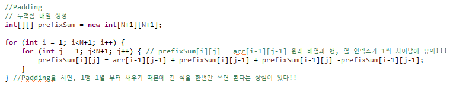
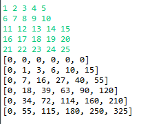
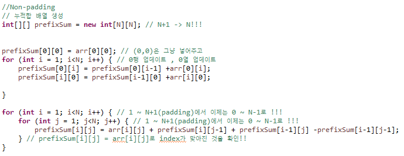
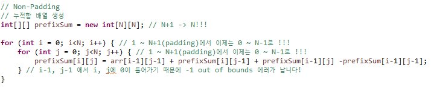
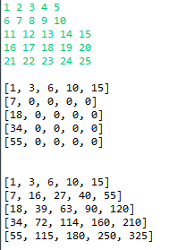

# 2차원 누적합 행렬의 생성

#### 어제 스터디한 코드가 최종 버전이 아니어서 이상한 부분이 끼어있었음.에 따른 보충설명!!

원래 배열
|1|2|3|4|5|
|---|---|---|---|---|
|6|7|8|9|10|
|11|12|13|14|15|
|16|17|18|19|20|

### padding 할 것이다.

 - 원래 배열과 prefixSum 사이의 index 차이가 1씩 생긴다.
 - 생성시에 반복문의 index를 1부터 사용하면서 긴 수식을 한번만 사용할 수 있다. 

<padding 생성>  

<padding 출력>  

 

### padding 안 할 것이다.

 - 원래 배열과 index가 동일하다.
 - 누적합 배열 생성을 위한 반복문에서 0행과 0열을 위해 분기를 나누어 처리해주어야 한다.  

<non_padding 생성>  

 

 

<non_padding index 에러> 인덱스만 바꿔주면 에러가 난다.

 

 

<non_padding 출력>  

 

 

