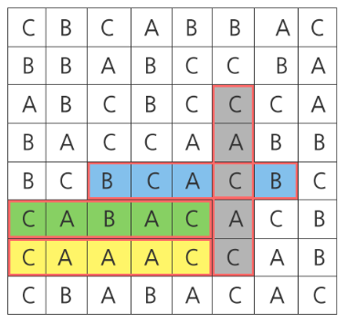

# SWEA_1215.회문1

출처: https://swexpertacademy.com/main/code/problem/problemDetail.do?contestProbId=AV14QpAaAAwCFAYi

---

## 문제

시간 : 10개 테스트케이스를 합쳐서 C++의 경우 10초 / Java의 경우 20초 / Python의 경우 30초  

메모리 : 힙, 정적 메모리 합쳐서 256MB 이내, 스택 메모리 1MB 이내

**※ SW Expert 아카데미의 문제를 무단 복제하는 것을 금지합니다.**

"기러기", "토마토", "스위스"와 같이 똑바로 읽어도 거꾸로 읽어도 똑같은 문장이나 낱말을 회문(回文, palindrome)이라 한다.

<center>



</center>

8x8 평면 글자판에서 제시된 길이를 가진 회문의 개수를 구하라.
 
위와 같은 글자판이 주어졌을 때, 길이가 5인 회문은 붉은색 테두리로 표시된 4개이므로 4를 반환하면 된다.

[제약 사항]

각 칸의 들어가는 글자는 'A', 'B', 'C' 중 하나이다.

ABA도 회문이며, ABBA도 회문이다. A 또한 길이 1짜리 회문이다.

가로 또는 세로로 이어진 회문의 개수만 센다.

아래 그림에서 노란색 경로를 따라가면 길이 7짜리 회문이 되지만 직선이 아니기 때문에 인정되지 않는다.

**[입력]**

총 10개의 테스트 케이스가 주어진다.

각 테스트 케이스의 첫 번째 줄에는 찾아야 하는 회문의 길이가 주어지며, 다음 줄에 8x8 크기의 글자판이 주어진다.

**[출력]**

#부호와 함께 테스트 케이스의 번호를 출력하고, 공백 문자 후 찾은 회문의 개수를 출력한다.
 
---

## 입출력 예시

입력

4
CBBCBAAB
CCCBABCB
CAAAACAB
BACCCCAC
AABCBBAC
ACAACABC
BCCBAABC
ABBBCCAA
4
BCBBCACA
BCAAACAC
ABACBCCB
AACBCBCA
ACACBAAA
ACCACCCB
AACAAABA
CACCABCB
 
출력
```
#1 12
#2 10
```
...
        

---
## 느낀 점

- deque 는 아주 유용하다. 
- queue, stack 을 모두 대체 가능하다.
- 대부분의 자료구조에서 많이들 활용하는 듯.