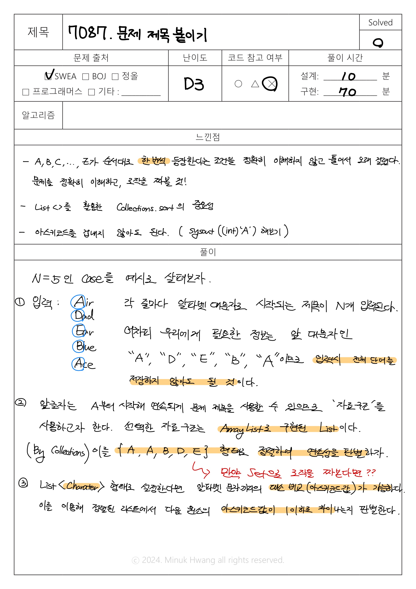

# SWEA_7087. 문제 제목 붙이기 D3

출처: https://swexpertacademy.com/main/code/problem/problemDetail.do?contestProbId=AWkIdD46A5EDFAXC


---

## 문제

시간 : 20개 테스트케이스를 합쳐서 C의 경우 1초 / C++의 경우 1초 / Java의 경우 2초  
메모리 : 힙, 정적 메모리 합쳐서 256MB 이내, 스택 메모리 1MB 이내


**※ SW Expert 아카데미의 문제를 무단 복제하는 것을 금지합니다.**


매번 혼자서 알고리즘 문제를 풀던 은기와 자영이는, 많은 사람들의 즐거움을 주기 위해 프로그래밍 대회를 개최하려고 한다.

은기와 자영이는 대회에 사용할 문제를 준비하는 과정에서 문제 제목을 정하게 되었다.

은기는 대회의 문제들에 사용할 수 있는 제목을 N개 만들었다.

자영이는 제목의 가장 앞 글자에 알파벳 대문자 A부터 시작하여, A, B, C, … , Z가 순서대로 한 번씩 등장하면 좋겠다고 하였다.

만약 도중에 특정 알파벳이 문제 제목의 맨 앞 글자로 등장하지 않으면 그 이후의 알파벳은 사용하지 않는다.

예를 들어, 문제 제목으로 Air, Dad, Ear, Blue, Ace가 있다면, A와 B는 등장하였지만, C는 등장하지 않았기 때문에 최대 2개의 문제 제목을 사용할 수 있는 것이다.

은기가 만든 문제들의 제목이 주어질 때, 자영이가 정한 규칙에 따라서 사용할 수 있는 최대 문제 제목의 개수를 계산하는 프로그램을 작성하라.


**[입력]**

첫 번째 줄에 테스트 케이스의 수 T가 주어진다.

각 테스트 케이스의 첫 번째 줄에는 하나의 정수 N ( 1 ≤ N ≤ 100 )이 주어진다.

다음 N개의 줄에 걸쳐서 은기가 만든 문제의 제목을 나타내는 문자열이 주어진다.

이 문자열을 구성하는 문자는 최대 30개를 넘지 않으며, 대문자 알파벳으로 시작하여, 영어 알파벳과 숫자, ‘_’로만 구성된다.


**[출력]**


각 테스트 케이스마다 ‘#x’(x는 테스트케이스 번호를 의미하며 1부터 시작한다)를 출력하고,

자영이가 정한 규칙에 따라서 사용할 수 있는 최대 문제 제목의 개수를 출력한다.

---

## 입출력 예시

입력  
```java
3            // 테스트 케이스 개수  
5            // 첫 번째 테스트 케이스, N=5  
Air  
Dad  
Ear  
Blue  
Ace  
3            // 첫 번째 테스트 케이스, N=3  
Snow_White  
A_Problem  
Another_Problem  
2  
Good_Problem  
Better_Problem  

```


 출력  
 ```java
#1 2  // 첫 번째 테스트 케이스 결과  
#2 1  
#3 0  
```
---
## 풀이




---

## 생각해보면 좋을 코드

```java
import java.io.BufferedReader;
import java.io.InputStreamReader;
 
public class Solution  {
    static int T, N;
    static int title[];
    static int ANSWER;
 
    public static void main(String[] args) throws Exception {
        BufferedReader in = new BufferedReader(new InputStreamReader(System.in));
 
        T = Integer.parseInt(in.readLine().trim());
        for (int test_case = 1; test_case <= T; test_case++) {
            N = Integer.parseInt(in.readLine().trim());
 
            title = new int[26];
 
            for(int i=0; i<N; i++) {
                title[in.readLine().toCharArray()[0]-'A']++;
            }
            ANSWER = -1;
            for(int i=0; i<26; i++) {
                if(title[i]==0) {
                    ANSWER = i;
                    break;
                }
            }
            if(ANSWER == -1) {
                ANSWER = 26;
            }
            System.out.println("#"+test_case+" "+ANSWER);
        }
    }
}
```


