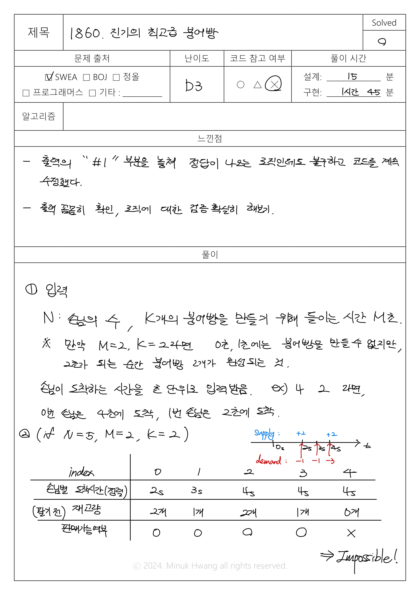

# # SWEA_1860. 진기의 최고급 붕어빵 D3

출처: https://swexpertacademy.com/main/code/problem/problemDetail.do?contestProbId=AV5LsaaqDzYDFAXc&


---

## 문제
시간 : 1000개 테스트케이스를 합쳐서 C++의 경우 1초 / Java의 경우 2초 / Python의 경우 4초  
메모리 : 힙, 정적 메모리 합쳐서 256MB 이내, 스택 메모리 1MB 이내

**※ SW Expert 아카데미의 문제를 무단 복제하는 것을 금지합니다.**

진기는 붕어빵 가게를 운영하고 있다.

진기가 파는 붕어빵은 그냥 붕어빵이 아니라 겉은 바삭! 속은 말랑! 한입 물면 팥 앙금이 주르륵 흘러 입안에서 춤을 추며,

절로 어릴 적 호호 불며 먹었던 뜨거운 붕어빵의 추억이 떠올라 눈물이 나오게 되는 최고급 붕어빵이다.

진기는 이런 붕어빵을 보통 사람들에게는 팔지 않는다.

그는 무조건 예약제로만 손님을 받으며, 예약을 하려는 손님들은 진기의 까다로운 자격 검증에서 합격해야만 붕어빵을 맛 볼 자격을 얻는다.

그래서 오늘은 N명의 사람이 자격을 얻었다.

진기는 0초부터 붕어빵을 만들기 시작하며, M초의 시간을 들이면 K개의 붕어빵을 만들 수 있다.

서빙은 진기가 하는 것이 아니기 때문에, 붕어빵이 완성되면 어떤 시간 지연도 없이 다음 붕어빵 만들기를 시작할 수 있다.

0초 이후에 손님들이 언제 도착하는지 주어지면, 모든 손님들에게 기다리는 시간없이 붕어빵을 제공할 수 있는지 판별하는 프로그램을 작성하라.


**[입력]**

첫 번째 줄에 테스트 케이스의 수 T가 주어진다.

각 테스트 케이스의 첫 번째 줄에는 세 자연수 N, M, K(1 ≤ N, M, K ≤ 100)가 공백으로 구분되어 주어진다.

두 번째 줄에는 N개의 정수가 공백으로 구분되어 주어지며,

각 정수는 각 사람이 언제 도착하는지를 초 단위로 나타낸다. 각 수는 0이상 11,111이하이다.


**[출력]**

각 테스트 케이스마다 ‘#x’(x는 테스트케이스 번호를 의미하며 1부터 시작한다)를 출력하고,

모든 손님에 대해 기다리는 시간이 없이 붕어빵을 제공할 수 있으면 “Possible”을, 아니라면 “Impossible”을 출력한다.


**[예제 풀이]**

2번째 테스트 케이스의 경우, 2초가 지날 때마다 붕어빵을 2개씩 만들 수 있다.

하지만 손님 1명은 1초에 도착하므로 이 손님에게는 붕어빵을 바로 제공할 수 없다.

따라서 결과값으로 Impossible 출력한다.


---

## 입출력 예시

입력
```java
4
2 2 2
3 4
2 2 2
1 2
2 2 1
4 2
2 2 1
3 2

```
 
 출력
 ```java
 #1 Possible
#2 Impossible
#3 Possible
#4 Impossible
 ```


---

## 풀이

82,936 kb
메모리,
345 ms
실행시간


---

## 생각해보면 좋을 코드

30,016 kb 메모리, 156 ms 실행시간

```java
import java.io.BufferedReader;
import java.io.BufferedWriter;
import java.io.IOException;
import java.io.InputStreamReader;
import java.io.OutputStreamWriter;
import java.util.Arrays;
import java.util.StringTokenizer;
 
class Solution
{
    public static void main(String args[]) throws Exception
    {
        BufferedReader br = new BufferedReader(new InputStreamReader(System.in));
        BufferedWriter bw = new BufferedWriter(new OutputStreamWriter(System.out));
        StringTokenizer st = new StringTokenizer(br.readLine());
         
        int T = Integer.parseInt(st.nextToken());
        for(int test_case = 1; test_case <= T; test_case++)
        {
           st = new StringTokenizer(br.readLine());
            boolean flag = false;
            int N = Integer.parseInt(st.nextToken());
            int M = Integer.parseInt(st.nextToken());
            int K = Integer.parseInt(st.nextToken());
            st = new StringTokenizer(br.readLine());
            int sum = 0;
            int[] arr = new int[N];
            for(int i=0; i<N; i++) {
                arr[i] = Integer.parseInt(st.nextToken());
            }
            Arrays.sort(arr);
            for(int i=0; i<N; i++) {
                sum = K * (arr[i]/M);
                if(sum < i+1) {
                    flag = false;
                    break;
                }
                flag = true;
            }
            if(flag) {
                bw.write("#" + test_case + " Possible" + '\n');
            }
            else {
                bw.write("#" + test_case + " Impossible" + '\n');
            } 
        }
        br.close();
        bw.flush();
        bw.close();
    }
}
```