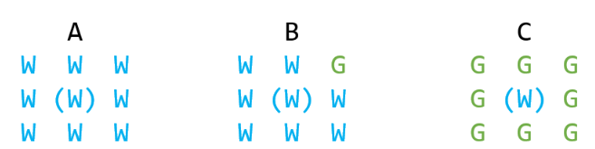

# SWEA_7236.저수지의 물의 총 깊이 구하기

출처: https://swexpertacademy.com/main/code/userProblem/userProblemDetail.do?contestProbId=AWlTKTUqCN8DFAVS

---

## 문제

시간 : 10개 테스트케이스를 합쳐서 C/C++의 경우 1초 / Java의 경우 1초
메모리 : 힙, 정적 메모리 합쳐서 256MB 이내, 스택 메모리 1MB 이내

**※ SW Expert 아카데미의 문제를 무단 복제하는 것을 금지합니다.**

NxN 구획으로 이루어진 지역에 있는 저수지의 물(W)의 총 깊이를 구하려 한다.                 
각 구획의 물(W)의 깊이는 구획을 애워싼 영역에 땅(G)이 있으면 땅을 뺀 합이 그 구획의 물 깊이다.  
하지만 둘러싼 모든 영역이 땅(G)인 경우  그 구획의 물 깊이는 1이된다. 
예를들어 다음과 같은 저수지가 있는 경우 중앙에 위치한 물의 깊이는 다음과 같이 구할수 있다.

<center>



</center>

A인 경우 중앙에 위치한 구획의 물 깊이는 8이고    
B인 경우 중앙에 위치한 구획의 물 깊이는 7이며    
C인 경우 중앙에 위치한 구획의 물 깊이는 1이다.   

NxN 구획으로 이루어진 지역에 있는 저수지의 물(W)의 총 깊이는 각 구획의 물 깊이 중 
가장 깊은 구획의 깊이가 저수지에서 가장 깊은 물의 깊이로 저수지의 총 깊이가 된다. 

[제약 조건]
저수지 구획의 크기(N)은 9<= N <= 100 이다.


**[입력]**

첫줄은 테스트 케이스(T)가 입력된다. 
두번째 줄부터 T개의 테스케이스의 데이타가 다음과 같은 순서로 입력된다. 
각 테스트 케이스의 첫 줄에는 저수지 구획의 크기(N)이 주어진다. 
그 다음 줄 부터 N줄에 걸쳐 지역 정보가 입력된다. 

**[출력]**

각 줄은 #Ti(테스트케이스 번호) 공백을 하나 둔 다음 문제의 답을 출력한다. 
 
---

## 입출력 예시

입력

4
6
G W G G W W
G W G G W G
W W W W G W
W G W W W G
G W W W W G
G W W G W G
5
G W G G W
G W G G W
W W W W G
W G W W W
G W W W W
3
G G W
G W W
W W W
3
G G G
G W G
G G G
 
출력
```
#1 7
#2 7
#3 5
#4 1
```
...
        

---
## 느낀 점

- 문제가 설명이 빈약하다
- W W W
- W G W
- W W W
- 는 0인가? 아니면 2인가?
- 구체적인 게 없어서 그냥 누적합 돌렸고 맞았다.