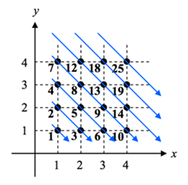
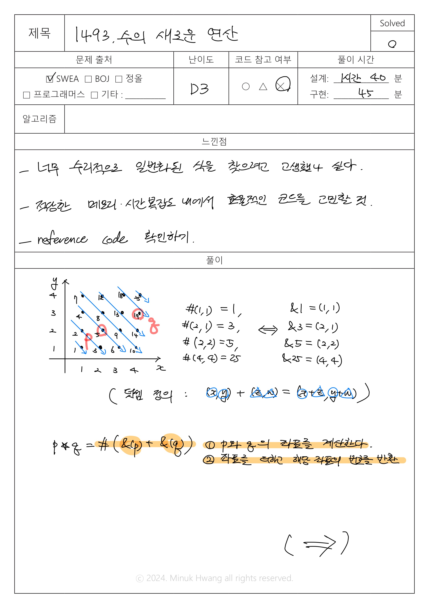
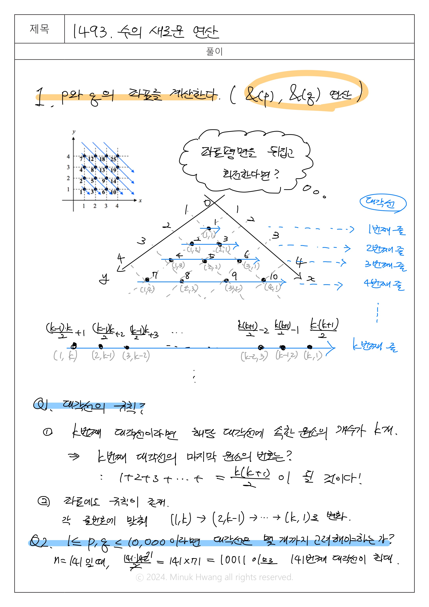
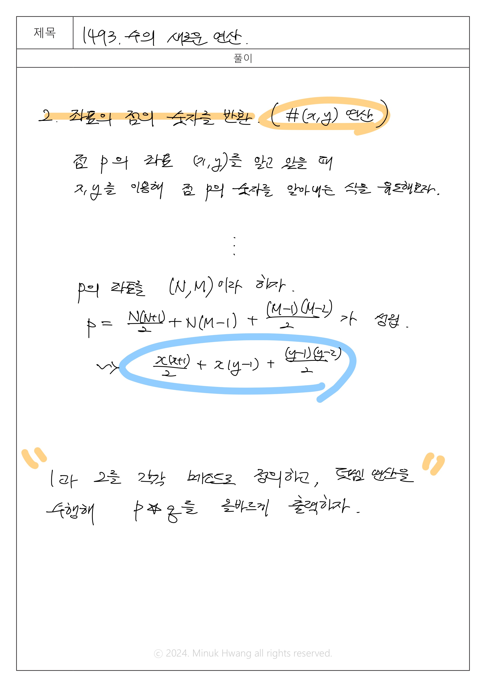

# SWEA_1493. 수의 새로운 연산 D3

출처: https://swexpertacademy.com/main/code/problem/problemDetail.do?contestProbId=AV2b-QGqADMBBASw


---

## 문제

시간 : 1000개 테스트케이스를 합쳐서 C++의 경우 1초 / Java의 경우 2초 / Python의 경우 4초  
메모리 : 힙, 정적 메모리 합쳐서 256MB 이내, 스택 메모리 1MB 이내


**※ SW Expert 아카데미의 문제를 무단 복제하는 것을 금지합니다.**




2차원 평면 제 1사분면 위의 격자점 (x,y)에 위 그림과 같이 대각선 순서로 점에 수를 붙인다.

점 (x,y)에 할당된 수는 #(x,y)로 나타낸다.

예를 들어 #(1,1) = 1, #(2,1)=3, #(2,2) = 5, #(4,4) = 25이다.

반대로 수 p가 할당된 점을 &(p)로 나타낸다.

예를 들어 &(1) = (1,1), &(3) = (2,1), &(5) = (2,2), &(25) = (4,4)이다.

두 점에 대해서 덧셈을 정의한다. 점 (x,y)와 점 (z,w)를 더하면 점 (x+z, y+w)가 된다.

즉, (x,y) + (z,w) = (x+z, y+w)로 정의한다.

우리가 해야 할 일은 수와 수에 대한 새로운 연산 ★를 구현하는 것으로, p★q는 #(&(p)+&(q))으로 나타난다.

예를 들어, &(1)=(1,1), &(5) = (2,2)이므로, 1★5 = #(&(1)+&(5)) = #((1,1)+(2,2)) = #(3,3) = 13이 된다.


**[입력]**

첫 번째 줄에 테스트 케이스의 수 T가 주어진다.

각 테스트 케이스의 첫 번째 줄에는 두 정수 p,q(1 ≤ p, q ≤ 10,000)가 주어진다.


**[출력]**

각 테스트 케이스마다 ‘#t’(t는 테스트 케이스 번호를 의미하며 1부터 시작한다)를 출력하고, 각 테스트 케이스마다 p★q의 값을 출력한다.

---

## 입출력 예시

입력  
```java
2
1 5
3 9

```

출력  
```java
#1 13
#2 26
```
---
## 풀이





---

```java
package _1493;

import java.io.FileInputStream;
import java.util.Scanner;

class Solution {
	public static void main(String args[]) throws Exception {

//		System.setIn(new FileInputStream("src/_1493/input.txt"));

		Scanner sc = new Scanner(System.in);
		int T;
		T = sc.nextInt();

		for (int test_case = 1; test_case <= T; test_case++) {

			// p와 q를 입력받기.
			int p = sc.nextInt();
			int q = sc.nextInt();

			// 아래 정의한 returnLocation() 메소드에 점 p, q를 각각 인자값으로 주기
			// 각 점의 좌표 (x, y)를 길이가 2인 array에 x, y 순서대로 담아서 return (문제에서 정의한 &(p), &(q)를 수행)
			int[] pArr = returnLocation(p);
			int[] qArr = returnLocation(q);

			// 문제에서 정의한대로 점 p와 q를 좌표끼리의 덧셈 연산을 수행
			// p의 x좌표: pArr[0], q의 x좌표: qArr[0]이므로 덧셈연산에 의해 새로운 점의 x좌표는 pArr[0]+qArr[0]이다.(y좌표도 방법 동일)
			int[] sumArr = {pArr[0]+qArr[0], pArr[1]+qArr[1]};

			// 아래 정의한 returnPointNumber() 메소드에 새로운 점의 좌표 array를 인자값으로 주기
			// 해당 좌표에 찍힌 점의 수를 return (문제에서 정의한 #(x,y)연산을 수행)
			int answer = returnPointNumber(sumArr);

			System.out.printf("#%d %d\n", test_case, answer);

		}

	}

	
	// 문제 속 &(p)를 수행하는 메소드 returnLocation()
	public static int[] returnLocation(int p) {

		// (x, y) 좌표를 담을 arr 선언
		int[] arr = new int[2];

		// 인자값으로 받은 점 p가 몇번째 대각선 줄에 있는지를 나타낼 line_num 선언 및 초기화
		int line_num = 0;
		// 대각선 줄에서 몇번째 인덱스에 위치하는지 정확한 좌표를 나타내기 이동해야할 값을 저장하는 delta_idx 선언 및 초기화
		int delta_idx = 0;

		// 방법 1. for문(10000번째의 점이 141번째 줄에 등장한다는 것을 알고 있다면 n은 141까지 증가 가능)
//		for (int n=1; n<142; n++) {
//			if (p==1 || p < ((n+1)*(n+2))/2-n) {
//				line_num = n;
//				delta_idx = p - ((n*(n+1))/2-(n-1));
//				break;
//			}
//		}

		// 방법 2. 몇번째 줄까지 증가하는지 계산해보지 않더라도 while문으로 n을 증가하며 line_num을 찾을 수 있음
		// 다음 대각선으로 넘어갈 때마다 대각선에 들어오는 원소의 개수는 1씩 증가한다.
		// N번째 대각선이라면 1+2+3+...+N=(N*(N+1))/2개의 원소가 대각선에 존재할 것임.
		// 대각선을 증가시키면서(n++) 인자값으로 받은 p가 몇번째 대각선에 위치하는지 찾는다.
		int n = 1;
		while (p >= n*(n+1)/2 - (n-1)) {
			n++;
		}
		// 점 p는 n번째 바로 직전 대각선에 위치함으로 n-1번째 대각선으로 line_num 갱신
		line_num = n - 1;
		// 대각선 내에서 x,y 좌표를 몇 칸 이동해야하는지 알려주는 delta_idx를 계산
		delta_idx = p - ((line_num * (line_num + 1)) / 2 - (line_num - 1));

		// 같은 대각선 내에서 (x,y)의 x+y=(대각선 줄 수)와 같고, 왼쪽부터 x는 1증가, y는 1감소하는 형태임
		// delta_idx만큼 x를 증가, y를 감소시켜 p의 (x,y)좌표를 계산해 반환한다.
		arr[0] = 1 + delta_idx;
		arr[1] = line_num - delta_idx;

		return arr;
	}

	
	// 문제 속 #(x, y)를 수행하는 메소드 returnPointNumber()
	public static int returnPointNumber(int[] arr) {
		// 반환하고자 하는 pointNumber 선언 및 초기화
		int pointNumber = 0;

		// x, y좌표를 각각 저장
		int x = arr[0];
		int y = arr[1];

		// x, y와 관련된 음함수 식으로 도출
		pointNumber = x*(x+1)/2 + x*(y-1) + (y-1)*(y-2)/2;

		return pointNumber;
	}

}
```
---

## 생각해보면 좋을 코드

```java
package _1493;

import java.io.BufferedReader;
import java.io.FileInputStream;
import java.io.InputStreamReader;
import java.util.StringTokenizer;
 
public class Solution_ref{
    
    static int[][] arr= new int[1001][1001];
     
    static void getNum() {
        int cnt = 1;
        for (int i = 1; cnt <= 100000; i++) {
            for (int j = 1, k = i; j <= i; j++, k--) {
                arr[k][j] = cnt++;
            }
        }
    }
     
    public static void main(String args[]) throws Exception {
//    	System.setIn(new FileInputStream("src/_1493/input.txt"));
        BufferedReader br = new BufferedReader(new InputStreamReader(System.in));
        int T;
        T = Integer.parseInt(br.readLine());
        getNum();
 
        for (int test_case = 1; test_case <= T; test_case++) {
            StringTokenizer st = new StringTokenizer(br.readLine());
            int p= Integer.parseInt(st.nextToken());
            int q= Integer.parseInt(st.nextToken());
            int r1, r2,c1,c2;
            r1=r2=c1=c2=0;
             
            for (int i = 0; i < 150; i++) {
                for (int j = 0; j < 150; j++) {
                    if (arr[i][j] == p) {
                        r1 = i;
                        c1 = j;
                    }
                    if (arr[i][j] == q) {
                        r2 = i;
                        c2 = j;
                    }
                }
            }
            p=r1+r2;
            q=c1+c2;
     
 
            System.out.println("#" + test_case + " " + arr[p][q]);
 
        }
    }
}
```


