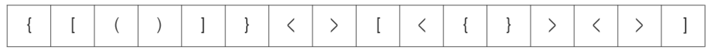
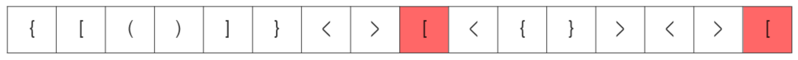
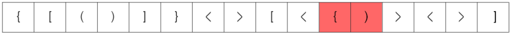
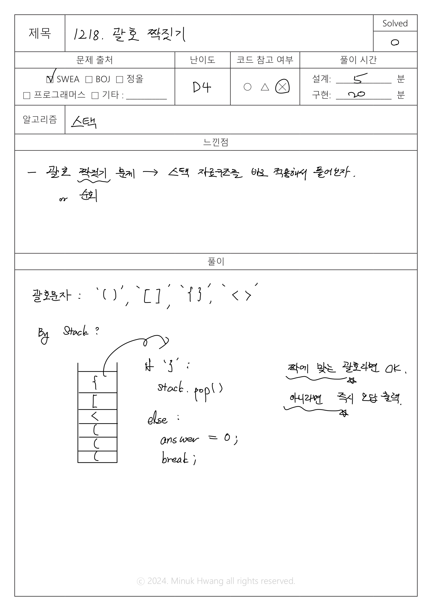

## SWEA_1218.괄호 짝짓기 D4

출처: https://swexpertacademy.com/main/code/problem/problemDetail.do?contestProbId=AV14eWb6AAkCFAYD

---

## 문제
시간 : 10개 테스트케이스를 합쳐서 C++의 경우 10초 / Java의 경우 20초 / Python의 경우 30초  
메모리 : 힙, 정적 메모리 합쳐서 256MB 이내, 스택 메모리 1MB 이내

**※ SW Expert 아카데미의 문제를 무단 복제하는 것을 금지합니다.**  

4 종류의 괄호문자들 '()', '[]', '{}', '<>' 로 이루어진 문자열이 주어진다.

이 문자열에 사용된 괄호들의 짝이 모두 맞는지 판별하는 프로그램을 작성한다.

예를 들어 아래와 같은 문자열은 유효하다고 판단할 수 있다.



아래와 같은 문자열은 유효하지 않은 문자열이다. 붉은색으로 표시된 괄호의 짝을 찾을 수 없기 때문이다.



아래 문자열은 열고 닫는 괄호의 개수는 유효하나 짝이 맞지 않는 괄호가 사용 되었기 때문에 유효하지 않다.



[입력]

각 테스트 케이스의 첫 번째 줄에는 테스트케이스의 길이가 주어지며, 바로 다음 줄에 테스트 케이스가 주어진다.

총 10개의 테스트케이스가 주어진다.

[출력]

#부호와 함께 테스트 케이스의 번호를 출력하고, 공백 문자 후 유효성 여부를 1 또는 0으로 표시한다 (1 - 유효함, 0 - 유효하지 않음).

---

## 입출력 예시

입력
```java
181
(({<(({{[[[[<<[[(<[[{([{{{[<[[[{<(<[[{}[]{}{}[]]]><><...
298
{(({[({([{(<[([(([<({[{{[[({{[({([<{(<[[((<{{[([{<<[{(<({[<(...
...

```
 
 출력
 ```java
#1 0
#2 0
...

 ```


---

## 풀이


메모리: 20,288 kb  
실행시간: 131 ms  





```java

package _1218;

import java.io.FileInputStream;
import java.util.Scanner;
import java.util.Stack;

public class Solution {
	
	public static void main(String args[]) throws Exception
	{
		System.setIn(new FileInputStream("src/_1218/input.txt"));
		Scanner sc = new Scanner(System.in);
		int T = 10;
		
		for(int test_case = 1; test_case <= T; test_case++)
		{
			
			// 각 테스트 케이스의 길이
			int N = sc.nextInt();
			
			// 다음 줄을 입력받기 위한 한 줄 입력
			sc.nextLine();
			
			// stack 자료 구조를 사용(여는 괄호를 담을 공간)
			Stack<Character> stack = new Stack<>();
			
			// 괄호 여러 개로 구성된 문자열을 charater형으로 쪼개 배열 형태로 저장
			char[] arr = sc.nextLine().toCharArray();
			
			// 괄호 유효성 여부(출력하고자 하는 정답: default는 1로 초기화)
			int answer = 1;
			
			// 괄호 문자열의 길이만큼 반복
			for (int i=0; i<N; i++) {
				// 만약 여는 괄호 '(', '{', '[', '<'라면 stack에 저장
				if (arr[i]=='(' || arr[i]=='{' || arr[i]=='[' || arr[i]=='<') {
					stack.add(arr[i]);
					
                // 만약 닫는 괄호라면 stack 위에서 하나 꺼내 짝이 맞는 괄호인지 확인
                // 짝이 맞지 않는다면 유효성 여부를 0으로 바꾸고, break.
				} else {
					char bracket = stack.pop();
					if (arr[i] == ')' && bracket !='(') {
						answer = 0;
						break;
					} else if (arr[i] == '}' && bracket !='{') {
						answer=0;
						break;
					} else if (arr[i] == ']' && bracket != '[') {
						answer=0;
						break;
					} else if (arr[i] == '>' && bracket != '<') {
						answer=0;
						break;
					}
					
				}
				
			}
			
			System.out.printf("#%d %d\n", test_case, answer);
		

		}
	}
}


```

<br>

**스택 구현 버전**

<br>

```java

package swea_1218_괄호짝짓기;

import java.io.FileInputStream;
import java.util.Scanner;

public class Solution {

	static char[] stack;
	static int top = -1;

	public static void main(String args[]) throws Exception {
		System.setIn(new FileInputStream("src/swea_1218_괄호짝짓기/input.txt"));
		Scanner sc = new Scanner(System.in);
		int T = 10;

		for (int test_case = 1; test_case <= T; test_case++) {

			// 각 테스트 케이스의 길이
			int N = sc.nextInt();

			// 다음 줄을 입력받기 위한 한 줄 입력
			sc.nextLine();

			// stack 자료 구조를 구하여 사용(여는 괄호를 담을 공간)
			stack = new char[N];

			// 괄호 여러 개로 구성된 문자열을 charater형으로 쪼개 배열 형태로 저장
			char[] arr = sc.nextLine().toCharArray();

			// 괄호 유효성 여부(출력하고자 하는 정답: default는 1로 초기화)
			int answer = 1;

			// 괄호 문자열의 길이만큼 반복
			for (int i = 0; i < N; i++) {
				// 만약 여는 괄호 '(', '{', '[', '<'라면 stack에 저장
				if (arr[i] == '(' || arr[i] == '{' || arr[i] == '[' || arr[i] == '<') {
					push(arr[i]);

					// 만약 닫는 괄호라면 stack 위에서 하나 꺼내 짝이 맞는 괄호인지 확인
					// 짝이 맞지 않는다면 유효성 여부를 0으로 바꾸고, break.
				} else {
					char bracket = pop();
					if (arr[i] == ')' && bracket != '(') {
						answer = 0;
						break;
					} else if (arr[i] == '}' && bracket != '{') {
						answer = 0;
						break;
					} else if (arr[i] == ']' && bracket != '[') {
						answer = 0;
						break;
					} else if (arr[i] == '>' && bracket != '<') {
						answer = 0;
						break;
					}

				}

			}

			System.out.printf("#%d %d\n", test_case, answer);

		}
	}

	public static boolean isEmpty() {
		return top == -1;
	}

	public static boolean isFull() {
		return top == stack.length - 1;
	}

	public static char pop() {
		if (isEmpty()) {
			System.out.println("stack이 비었습니다. pop이 불가합니다.");
			return '1';
		} else {
			return stack[top--];
		}

	}

	public static void push(char data) {
		if (isFull()) {
			System.out.println("stack이 꽉 찼습니다. push가 불가합니다.");
		} else {
			stack[++top] = data;
		}

	}

}


```