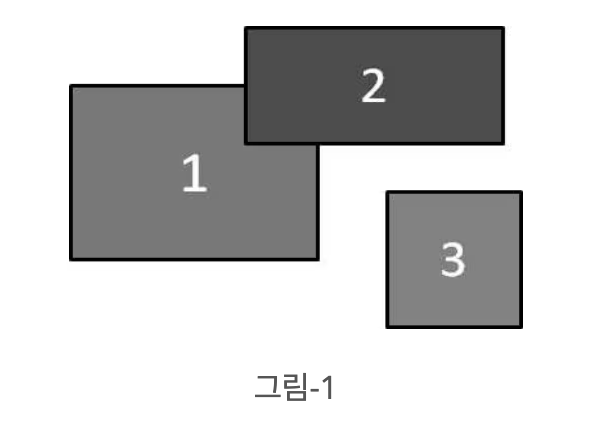
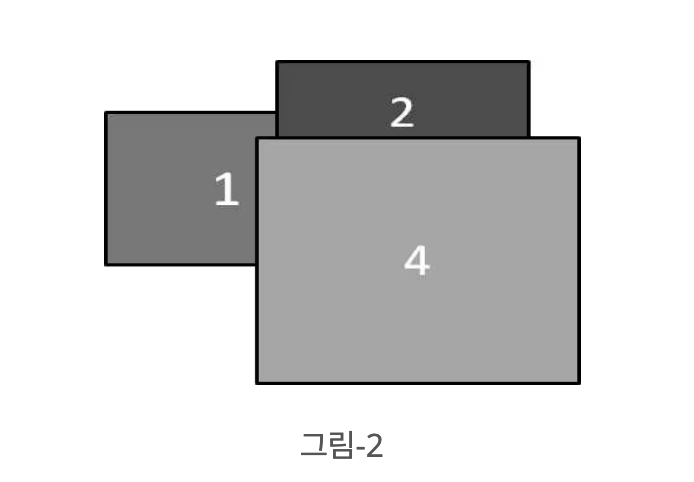
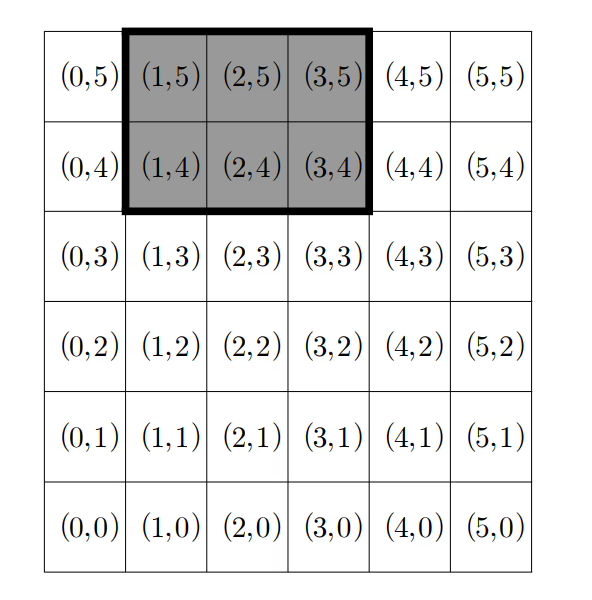
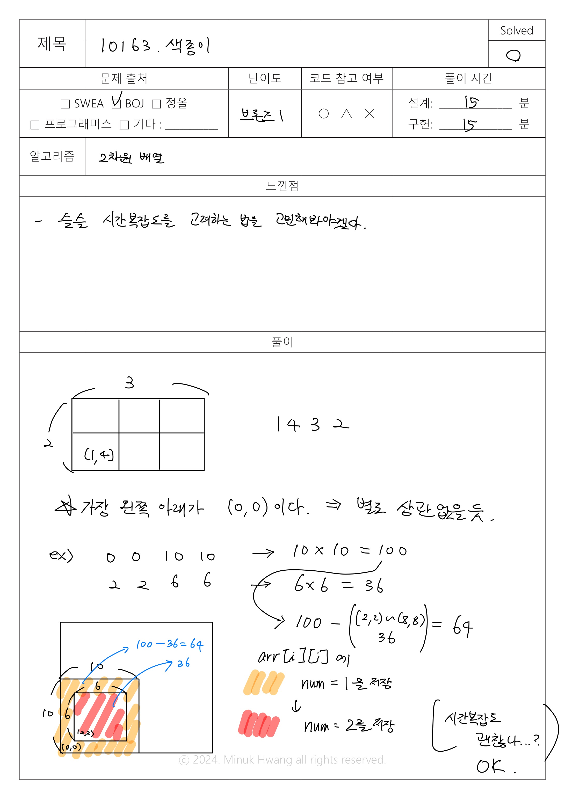

## BOJ_10163.색종이 (브론즈1)

출처: https://www.acmicpc.net/problem/10163

---

## 문제


|   시간 제한   |   메모리 제한 |
|   ---       |     ---    |
|   1초      |    64MB     |


평면에 색깔이 서로 다른 직사각형 모양의 색종이 N장이 하나씩 차례로 놓여진다. 이때 색종이가 비스듬하게 놓이는 경우는 없다. 즉, 모든 색종이의 변은 서로 평행하거나, 서로 수직이거나 둘 중 하나이다. 그림-1은 1번, 2번, 3번 세 장의 색종이가 순서대로 놓인 상태를 보여준다.




여기에 그림-2에서 보인 것처럼 4번 색종이가 하나 더 놓이면 3번 색종이는 완전히 가려서 보이지 않게 된다. 그리고, 1번 색종이와 2번 색종이는 부분적으로 가려 보이며, 4번 색종이는 완전히 보이게 된다.




N장의 색종이가 주어진 위치에 차례로 놓일 경우, 각 색종이가 보이는 부분의 면적을 구하는 프로그램을 작성하시오. 

---

### 입력
입력의 첫 번째 줄에는 색종이의 장수를 나타내는 정수 N (1 ≤ N ≤ 100)이 주어진다. 이어서 N장의 색종이에 관한 입력이 각 색종이마다 한 줄씩 차례로 주어진다. 색종이가 놓이는 평면은 가로 최대 1001칸, 세로 최대 1001칸으로 구성된 격자 모양이다. 격자의 각 칸은 가로, 세로 길이가 1인 면적이 1인 정사각형이다. 

편의상 가로 6칸, 세로 6칸으로 이루어진 격자의 예를 들어 설명하면, 각 칸에 표시된 값 (a,b)는 해당 칸의 번호를 나타낸다. 가장 왼쪽 아래의 칸은 (0,0) 가장 오른 쪽 위의 칸은 (5,5)이다. 




색종이가 놓인 상태는 가장 왼쪽 아래 칸의 번호와 너비, 높이를 나타내는 네 정수로 표현한다. 예를 들어, 위 그림에서 회색으로 표시된 색종이는 (1,4)가 가장 왼쪽 아래에 있고 너비 3, 높이 2이므로 1 4 3 2로 표현한다. 색종이가 격자 경계 밖으로 나가는 경우는 없다. 

---

### 출력
입력에서 주어진 순서에 따라 N장의 색종이를 평면에 놓았을 때, 입력에서 주어진 순서대로 각 색종이가 보이는 부분의 면적을 한 줄에 하나씩 하나의 정수로 출력한다. 만약 색종이가 보이지 않는다면 정수 0을 출력한다. 

---

### 서브태스크


|   번호   |   배점   |   제한   |
|   ---   |   ---   |   ---   |
|    1    |    11   |   N=1   |
|    2    |    12   |   N ≤ 10이고, 모든 색종이는 너비 1, 높이 1이다. 색종이가 놓여지는 평면은 가로 101칸, 세로 101칸으로 구성된 격자 모양이다.  |
|    3    |    30   |   N ≤ 10이고, 색종이가 놓여지는 평면은 가로 101칸, 세로 101칸으로 구성된 격자 모양이다.   |
|    4    |    47   |   원래의 제약조건 이외에 아무 제약 조건이 없다.   |


---

## 입출력 예시

입력
```java
2
0 0 10 10
2 2 6 6

```
 
 출력
 ```java
64
36
 ```

---


입력
```java
3
0 2 10 10
7 9 8 4
8 4 10 6

```
 
 출력
 ```java
81
25
60
 ```

---

입력
```java
4
0 2 10 10
7 9 8 4
8 4 10 6
6 0 12 10
```
 
 출력
 ```java
62
24
0
120
 ```

---

## 풀이


메모리: 20,288 kb  
실행시간: 131 ms  





```java
package BOJ_10163_색종이;

import java.util.Scanner;

public class Main {

	public static void main(String[] args) {

		Scanner sc = new Scanner(System.in);

		int N = sc.nextInt();

		// 색종이를 올릴 평면 전체를 2차원 배열로 선언(1001 x 1001)
		int arr[][] = new int[1001][1001];

		// 놓여지는 색종이 순서에 따라 위에서 보여질 색종이의 면적을 확인하기 위한 번호 num선언
		int num = 0;
		
		// N개의 색종이만큼 for문을 반복
		for (int i = 0; i < N; i++) {
			// num을 1씩 증가
			num++;
			// 색종이의 정보는 총 4개
			// paper[0]은 왼쪽 아래 행번호, paper[1]은 왼쪽 아래 열번호, 나머지는 색종이의 크기
			int[] paper = new int[4];

			// 색종이의 정보 입력받기
			for (int k = 0; k < 4; k++) {
				paper[k] = sc.nextInt();
			}

			
			// 좌표 + 너비만큼, 즉 색종이의 크기만큼 해당하는 arr[idx][idx2]에 각 색종이의 번호, num을 할당
			// for문을 반복하며 색종이의 좌표가 겹친다면 번호는 뒤에 등장하는 색종이의 번호로 갱신될 것임
			for (int idx = paper[0]; idx < paper[0] + paper[2]; idx++) {
				for (int idx2 = paper[1]; idx2 < paper[1] + paper[3]; idx2++) {
					arr[idx][idx2] = num;
				}
			}

			

		}
		
		// 전체 색종이의 개수만큼 sum을 계산
		for (int n = 1; n <= num; n++) {
			// 번호별로 sum을 0으로 초기화
			int sum = 0;
			// arr를 탐색하며 각 번호에 맞는 면적을 계산
			for (int r = 0; r < arr.length; r++) {
				for (int c = 0; c < arr[0].length; c++) {
					if (arr[r][c] == n) {
						sum++;

					}
				}
			}
			System.out.println(sum);
		}
		
		sc.close();

	}

}

```


## 생각해보면 좋을 코드

```java

import java.io.IOException;
import java.util.Arrays;

public class Main {

    static int[][] map = new int[1001][1001];

    public static void main(String[] args) throws IOException {
        int N = readInt();

        int xMax = 0;
        int yMax = 0;
        for(int i=1;i<=N;i++){
            int x1 = readInt();
            int y1 = readInt();
            int x2 = x1 + readInt() - 1;
            int y2 = y1 + readInt() - 1;

            // Arrays.fill()메소드로 2차원 배열인 map을 각 색종이 번호(i)로 초기화
            // Arrays.fill(배열 변수, 시작, 끝+1, 초기화할 값)
            for(int x = x1; x <= x2; x++) Arrays.fill(map[x], y1, y2+1, i);
            // Max는 주어진 모든 직사각형 중 가장 오른쪽 끝 좌표를 의미
            if(x2 > xMax) xMax = x2;
            if(y2 > yMax) yMax = y2;
        }
        // checkArea 함수를 호출하여 각 영역의 크기를 계산하고 출력
        checkArea(N, xMax, yMax);
    }

    // 각 색종이 번호별로 보이는 영역 크기를 출력
    static void checkArea(int N, int x, int y){
        StringBuilder sb = new StringBuilder();
        int[] area = new int[N+1];

        // 각 색종이 번호가 나타나는 횟수를 'area'배열에 저장
        for(int i = 0;i<=x;i++){
            for(int j=0;j<=y;j++){
                area[map[i][j]]++;
            }
        }

        for(int i=1;i<=N;i++) sb.append(area[i]).append('\n');
        System.out.print(sb);
    }

    // 입력 관련 최적화...?
    static int idx, size, SIZE = 1 << 13;
    static byte[] buf = new byte[SIZE];

    static int readInt() throws IOException {
        int n = 0;
        byte c;
        while ((c = read()) <= 32) ;
        do n = (n << 3) + (n << 1) + (c & 15);
        while (47 < (c = read()) && c < 58);
        return n;
    }

    static byte read() throws IOException {
        if (size == idx) {
            size = System.in.read(buf, idx = 0, SIZE);
            if (size < 0) buf[0] = -1;
        }
        return buf[idx++];
    }
}

```