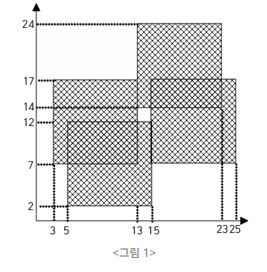

# BOJ_2567.색종이2

출처: https://www.acmicpc.net/problem/2567

---
시간 제한	메모리 제한	제출	정답	맞힌 사람	정답 비율
1 초	128 MB	10124	4431	3510	43.414%

## 문제

가로, 세로의 크기가 각각 100인 정사각형 모양의 흰색 도화지가 있다. 이 도화지 위에 가로, 세로의 크기가 각각 10인 정사각형 모양의 검은색 색종이를 색종이의 변과 도화지의 변이 평행하도록 붙인다. 이러한 방식으로 색종이를 한 장 또는 여러 장 붙인 후 색종이가 붙은 검은 영역의 둘레의 길이를 구하는 프로그램을 작성하시오.

예를 들어 흰색 도화지 위에 네 장의 검은색 색종이를 <그림 1>과 같은 모양으로 붙였다면 검은색 영역의 둘레는 96 이 된다.

**[입력]**

첫째 줄에 색종이의 수가 주어진다. 이어 둘째 줄부터 한 줄에 하나씩 색종이를 붙인 위치가 주어진다. 색종이를 붙인 위치는 두 개의 자연수로 주어지는데 첫 번째 자연수는 색종이의 왼쪽 변과 도화지의 왼쪽 변 사이의 거리이고, 두 번째 자연수는 색종이의 아래쪽 변과 도화지의 아래쪽 변 사이의 거리이다. 색종이의 수는 100이하이며, 색종이가 도화지 밖으로 나가는 경우는 없다. 

**[출력]**

첫째 줄에 색종이가 붙은 검은 영역의 둘레의 길이를 출력한다.
 
---

## 입출력 예시

입력

4  
3 7  
5 2  
15 7  
13 14  
 
출력  
96

     

---
## 느낀 점

- 긴가민가할 때는 그냥 해봐야 한다ㅠㅠ
- 왼쪽, 오른쪽 모든 조건을 주의깊게 살펴서 가능할지 안할지, 혹은 너무 복잡하진 않을지 잘 생각해야 뻘짓을 안한다.
