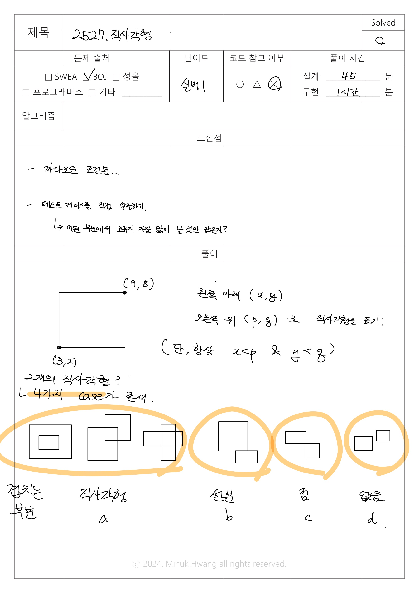
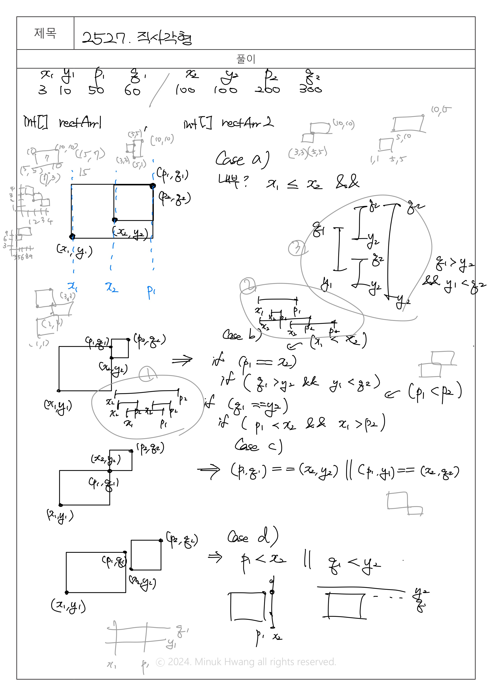

# BOJ_2527.직사각형 (실버 1)

출처: https://www.acmicpc.net/problem/2527

 

## 문제

 

2차원 격자공간에 두 개의 꼭짓점 좌표로 표현되는 직사각형이 있다. 직사각형은 아래와 같이 왼쪽 아래 꼭짓점 좌표 (x, y)와 오른쪽 위 꼭짓점 좌표 (p, q)로 주어진다.

이 문제에서 모든 직사각형은 두 꼭짓점의 좌표를 나타내는 4개의 정수 x y p q 로 표현된다. 단 항상 x<p, y<q 이다. 예를 들어 위 그림에 제시된 직사각형이라면 아래와 같이 표현된다.

`3 2 9 8`

두 개의 직사각형은 그 겹치는 부분의 특성에 따라 다음 4가지 경우로 분류될 수 있다. 

먼저 두 직사각형의 겹치는 부분이 직사각형인 경우이다. 아래 그림(a)는 공통부분이 직사각형인 경우의 3가지 예를 보여준다.

그림 (a)

 

또는 겹치는 부분이 아래 그림 (b)와 같이 선분이 될 수도 있고, 그림 (c\)와 같이 점도 될 수 있다. 

그림 (b)

 

그림 (c\)

 

마지막으로 아래 그림 (d)와 같이 공통부분 없이 두 직사각형이 완전히 분리된 경우도 있다.

그림 (d)

 

여러분은 두 직사각형의 겹치는 부분이 직사각형인지, 선분인지, 점인지, 아니면 전혀 없는 지를 판별해서 해당되는 코드 문자를 출력해야 한다. 

|공통부분의 특성|	코드 문자|
|---|---|
|직사각형|	a|
|선분|	b|
|점|	c|
|공통부분이 없음|	d|

## 설계

