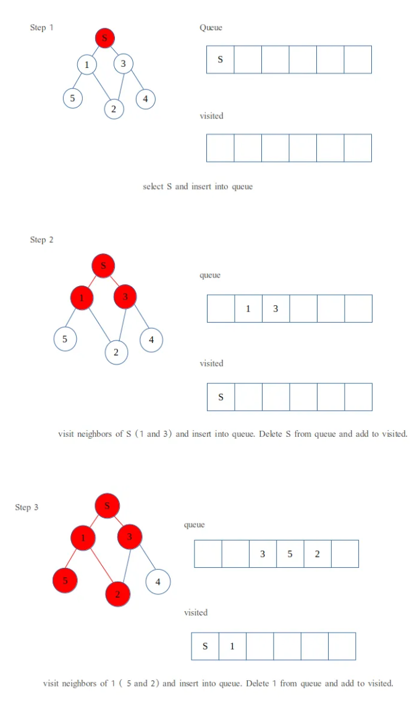

# BFS (Breadth First Search)

## 그래프 이론

그래프 : Node 와 Edge로 이루어진 자료구조

<p align="center">
  
  
</P>  

각각의 데이터 (대체로 위치) 와 그 연결성을 표현한 자료구조.  
'내비게이션' 분야에서 중점적으로 다루지만, 폭넓게 쓰일 수 있기 때문에 앞으로 여러가지 방법으로 지지고 볶을 자료구조.  

## 관련 알고리즘
나의 **목적**에 따라 서로 다른 알고리즘을 사용하게 됨.

## BFS

### 오늘의 목적: `특정 Node에서 다른 Node로 갈 수 있는 가장 빠른 이동횟수(최단거리)는 무엇일까?`  
`최단거리 = BFS` 라는 공식이 어느 정도 맞음.

### BFS ?

- 주어진 Node에서 가까운 Node부터 탐색함.
- 같은 거리(depth)의 Node들을 모두 탐색했으면, 다음 depth의 Node들을 탐색함.
- **Queue** 를 이용해 구현함

- 재귀적으로 BFS를 사용한 코드들이 있지만, BFS는 꼭 재귀적으로 작동하지는 않음.
- 하나의 거대한 Queue에 앞으로 탐색할 Node들을 순서를 지켜 채워넣을 뿐임.

### 알고리즘
1. 앞으로 탐색할 Node들을 채워 넣을 Queue를 만든다.
2. 시작 Node가 주어진다.
3. 시작 Node에서 연결된 가까운 Node들을 Queue에 넣는다.
4. Queue 에서 하나를 꺼낸다.
5. (해당 Node를 Visited 로 설정해, 다시 방문하지 않도록 한다.) -> 문제 특성에 따라 달라질 수 있음.
6. 꺼낸 Node와 연결된 Node들을 Queue에 넣는다.
7. 4~6을 Queue가 빌 때까지 반복한다.

<p align="center">
  
</P> 
<p align="center">
  
</P> 
<p align="center">
  
</P> 


### 연결성

1. 인접행렬을 사용하거나,  
2. 메모리를 아끼고, 간단히 하려고 연결된 Node들만을 표시한다.

#### 인접행렬
<p align="center">
  
</P> 
각 Node들을 Index로 하는 정사각행렬을 만들어 연결되어 있으면 1, 안돼있으면 0으로 표시한다.

#### 그 밖에도, 클래스를 생성하거나, 단순히 연결된 Node의 숫자만 표시할 수도 있다.

```java
int[][] edges = {
    {1,3},
    {0,2,5},
    {1,3},
    {0,2,4},
    {3},
    {1}
}
```


### 궁금증

- :question: 왜 Queue 인가요?
    - 같은 거리(depth) 내의 Node 들을 동시에 Queue에 집어넣고, 선입선출(FIFO) 방식을 취할 것이기 때문.
    - 1번 Node 에서 연결된 2, 3, 4 Node들을 Queue에 넣고,
    - '2'번 Node 에서 연결된 5 를 넣고,
    - **5로 이동하는게 아니라!!!**
    - '3'번 Node 에서 연결된 6, 7 을 넣고,
    - '4'번 Node 에서 연결된 8 을 넣고 나서야,  

    - **5번 Node** 로 이동해서 연결된 Node들을 queue에 넣음.

    - <U>즉, '거리'를 기준으로 가까운 것부터 탐색한다는 원리가 Queue의 '선입선출' 특성과 맞아떨어지기 때문!!!!! </U>

- :question: 이게 왜 최단 거리를 알려주죠?
    - 거리는 곧 depth 임.
    - BFS는 한 depth 를 모두 훑은 다음에 다음 층으로 내려감.
    - 내가 가고 싶은 목적지 Node 의 번호를 알면,
    - 목적지 Node를 만났을 때 현재 내가 있는 depth 가 곧 목적지까지의 거리임.

- :question: DFS 에서는 함수 호출 횟수로 Depth를 계산할 수 있는데, BFS 는 어떻게 하죠?
    - 먼저 depth 변수를 따로 만들어야함.
    - **한 depth 를 모두 훑었다면, 다음 queue에 있는 원소를 꺼내기 전에 depth에 1을 더해주면 됨.**
    - 다시 말해, 한 depth 에 있는 Node들의 개수를 알면,
    - queue에서 해당 개수만큼이 꺼내졌을 떄마다, depth 변수를 Update(+=1)하면 된다.
    -  
    - 따라서 내가 해줘야 할 것은,
    - queue에서 하나 꺼내고, 연결된 거 다 add하고를 반복하는 와중에
    - 다음번 depth 에서 몇 개까지 꺼내면 depth를 넘길건지를 <U>Queue의 길이</U>를 구해 정해놔야함.


#### 출처
https://en.wikipedia.org/wiki/Tree_%28graph_theory%29  
https://medium.com/geekculture/breadth-first-search-in-java-d32d29f6bb9e  
https://developer-mac.tistory.com/64


