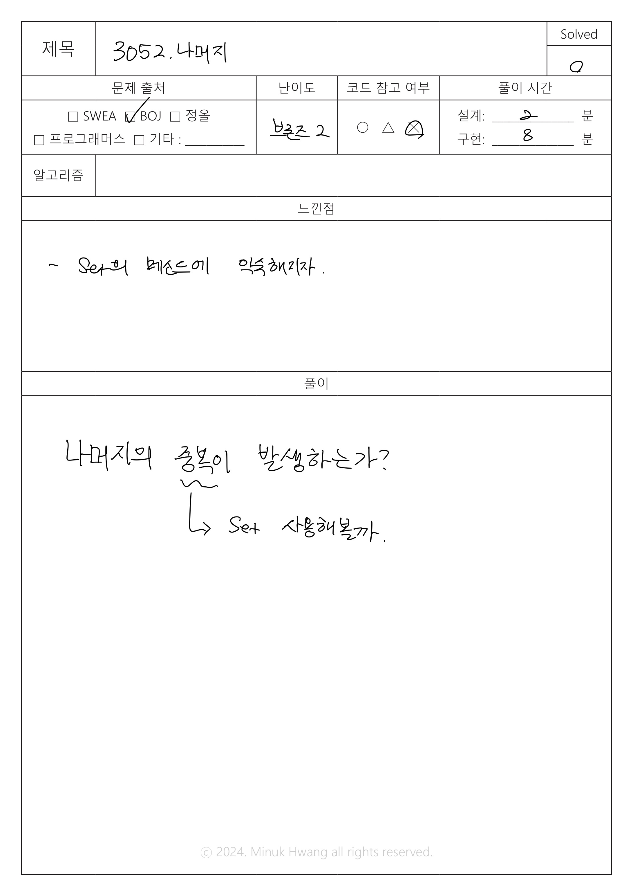

# BOJ_3052. 나머지 (브론즈 2)


출처: https://www.acmicpc.net/problem/3052


|   시간 제한   |   메모리 제한 |
|   ---       |     ---    |
|   1초      |    128MB     |

<br>

## 문제

<br>

두 자연수 A와 B가 있을 때, A%B는 A를 B로 나눈 나머지 이다. 예를 들어, 7, 14, 27, 38을 3으로 나눈 나머지는 1, 2, 0, 2이다. 

수 10개를 입력받은 뒤, 이를 42로 나눈 나머지를 구한다. 그 다음 서로 다른 값이 몇 개 있는지 출력하는 프로그램을 작성하시오.


<br>

## 입력

<br>

첫째 줄부터 열번째 줄 까지 숫자가 한 줄에 하나씩 주어진다. 이 숫자는 1,000보다 작거나 같고, 음이 아닌 정수이다.


<br>

## 출력

<br>

첫째 줄에, 42로 나누었을 때, 서로 다른 나머지가 몇 개 있는지 출력한다.


<br>

## 입출력 예시

<br>


**예제 입력 1**

```
1
2
3
4
5
6
7
8
9
10
```

**예제 출력 1**

```
10
```

---

**예제 입력 2**
```
42
84
252
420
840
126
42
84
420
126
```

**예제 출력 2**
```
1
```

---

**예제 입력 3**
```
39
40
41
42
43
44
82
83
84
85
```

**예제 출력 3**
```
6
```

<br>

## 풀이

<br>

