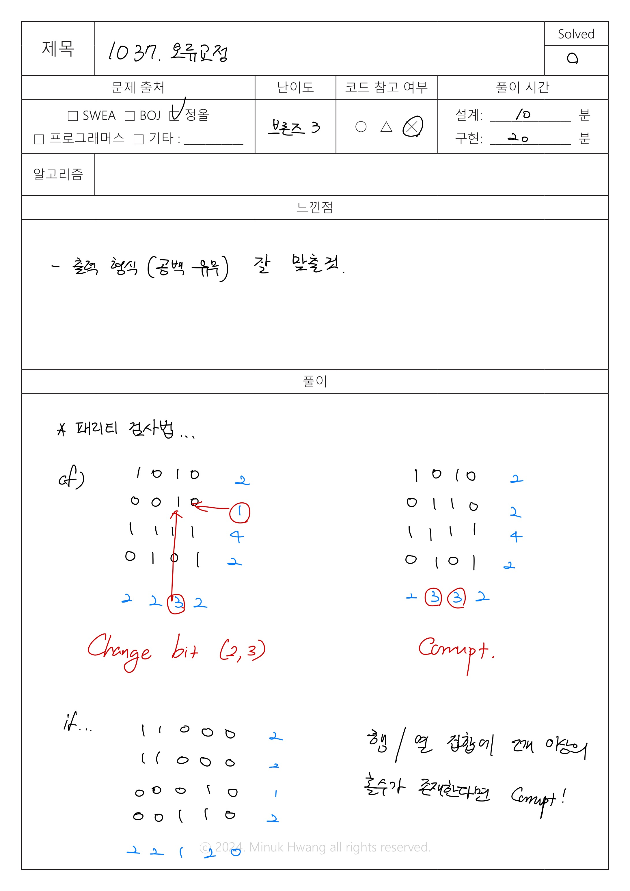
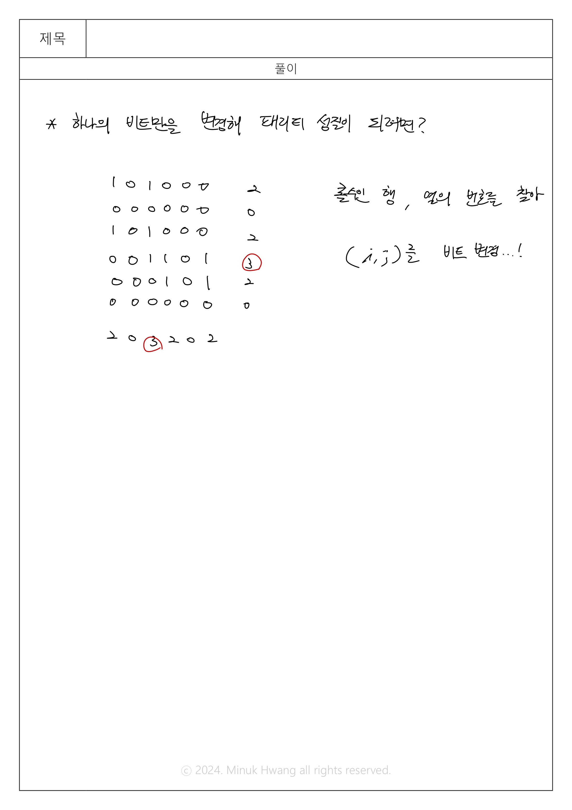

# JOL_1037. 오류교정 (브론즈 3)


출처: https://www.jungol.co.kr/problem/1037


|   시간 제한   |   메모리 제한 |
|   ---       |     ---    |
|   1000ms      |    32MB     |

<br>

## 문제

<br>


패리티 검사법은 메시지를 주고받을 때 메시지가 패리티 성질을 가지고 있을 경우엔 메시지가 제대로 도착을 하였다 보고 그렇지 않을 경우 메시지가 제대로 도착을 하지 않았다고 판별을 하는 메시지 전송시의 오류 판별 및 교정을 하는 방법을 말한다.

 

불리언 행렬의 각각의 열과 각각의 행이 짝수 합을 가질 때 패리티 성질을 가지고 있다고 하자. 다시 말하자면 한 집합에 짝수개의 1이 있다는 이야기 이다.

 

아래는 패리티 성질을 가진 4 x 4의 행렬이다.

 

1 0 1 0

0 0 0 0 

1 1 1 1 

0 1 0 1

 

각각의 행의 합은 2, 0, 4, 2 이고 열의 합은 2, 2, 2, 2 이다.

 

당신이 할일은 행렬의 정보를 읽어서 이것이 패리티 성질을 가지고 있는지 없는지 판단해야한다. 만약 그렇지 않을 경우 하나의 비트를 바꿔서 이 행렬이 패리티 성질을 가질 수 있는가 확인하고 그렇지 않을 경우 행렬은 잘못된 행렬이라고 판단한다.​ 


<br>

## 입력

<br>

첫줄에는 행렬의 크기인 n(n<100) 이 입력되며 n개의 줄에 n개의 0혹은 1이 입력된다.


<br>

## 출력

<br>

만약 행렬이 패리티 성질을 가질 경우 "OK"라 출력하고 하나의 비트만을 변경해서 패리티 성질을 가질 경우 바꿔야 될 비트가 있는 i행 j열 에 대해 "Change bit (i,j)" 라 출력하며 두 경우에 해당되지 않을 때는 "Corrupt"라고 출력한다. 


<br>

## 입출력 예시

<br>

**예제1**

입력

```
4
1 0 1 0
0 0 0 0
1 1 1 1
0 1 0 1
```

출력
```
OK
```


**예제2**

입력

```
4
1 0 1 0
0 0 1 0
1 1 1 1
0 1 0 1
```

출력

```
Change bit (2,3)
```

**예제3**

입력

```
4
1 0 1 0
0 1 1 0
1 1 1 1
0 1 0 1
```

출력

```
Corrupt
```


<br>

## 풀이

<br>




