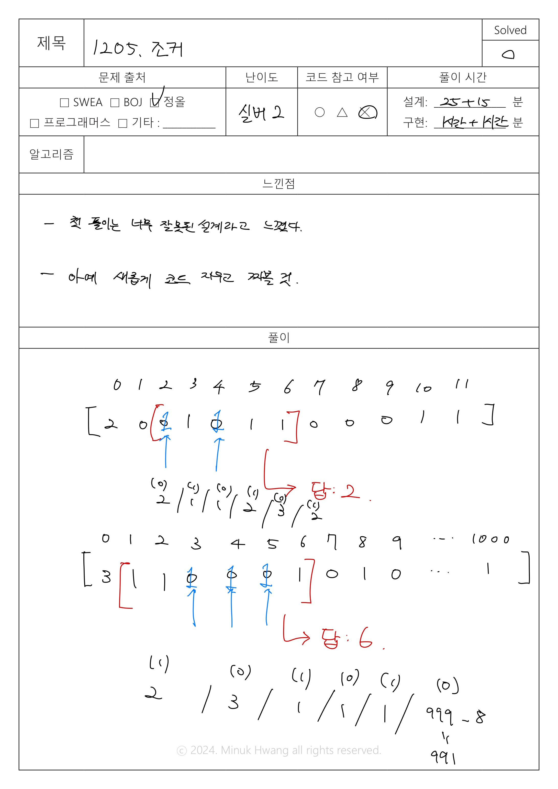
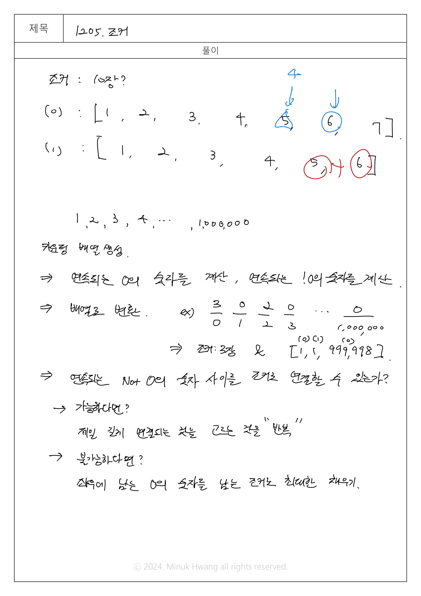
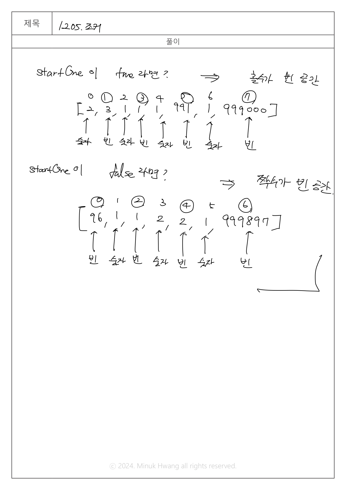
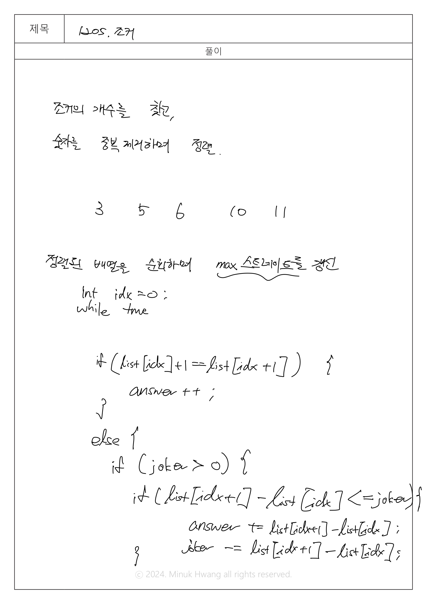

# JOL_1025. 조커 (실버 2)


출처: https://jungol.co.kr/problem/1205


|   시간 제한   |   메모리 제한 |
|   ---       |     ---    |
|   1000ms      |    32MB     |

<br>

## 문제

<br>

N개의 숫자가 적힌 카드가 있다. 

 

이 카드들 중에서 몇 개를 가지고 숫자가 1씩 증가하는 순서대로 늘어놓은 경우를 스트레이트라고 한다. 

예를 들어 1, 2, 5, 7, 3, 4 의 숫자가 적힌 카드가 있을 때 1, 2, 3, 4, 5를 뽑아서 순서대로 늘어놓을 경우 이는 길이 5의 스트레이트라고 한다.

 

숫자 0 이 적힌 카드가 있는데 이는 조커라고 하며, 자신이 원하는 어떤 숫자로도 변환이 가능하다.

 

조커 카드와 일반 카드가 주어졌을 때 가장 긴 길이의 스트레이트를 만드는 프로그램을 작성하라.


<br>

## 입력

<br>

입력의 첫 번째 줄에는 카드의 갯수 N(N≤1,000)이 입력된다. 그 다음 줄에는 N개의 카드에 적힌 숫자가 입력된다. 입력되는 카드에 적힌 숫자의 범위는 0 이상 1,000,000 이하이다. 0은 조커를 의미한다.


<br>

## 출력

<br>

입력된 카드들을 가지고 만들 수 있는 스트레이트의 최대 길이를 출력한다.


<br>

## 입출력 예시

<br>

**예제1**

입력

```
7 
0 6 5 10 3 0 11
```

출력
```
5
```


**예제2**

입력

```
6
100 100 100 99 97 103
```

출력

```
2
```

**예제3**

입력

```
8
0 0 0 1 2 6 8 1000
```

출력

```
6
```


<br>

## 풀이

<br>








