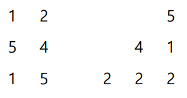

# BOJ_14673. Crush Fever


출처: https://www.acmicpc.net/problem/14673


|   시간 제한   |   메모리 제한 |
|   ---       |     ---    |
|   1.5초      |    512 MB     |

<br>

## 문제

<br>


게임 덕후 준서는 PC, PlayStation, XBOX 등 게임 플랫폼을 가리지 않고 모든 게임을 다 해보기로 유명하다. 그는 최근에 Mobile App Store에서 ‘Crush Fever’란 게임을 발견했다. 그 게임은 ‘퍼○도라’로 유명한 게임의 변형판 인데, 일반적인 파티 편성 게임과 달리 독특하게 퍼즐의 요소가 결합되어 있다. 해당 게임은 크게 유닛 육성, 관리 부분과 던전 공략으로 나뉘어져 있다. 준서는 던전공략을 손으로 진행하다가 진행이 잘 되지 않자 화가 나서 핸드폰을 집어 던졌다. 그리고 잠깐 물을 마시면서 화를 식히고 있던 도중에 좋은 아이디어가 떠올랐다.

“던전을 내 손과 뇌로 못 깬다면 프로그램으로 깨게 만들면 되잖아?”

하지만 준서는 매우매우매우 귀찮았기 때문에 효과적인 퍼즐 해결 부분은 작성하고 싶어 하지 않았다. 아무리 그래도 준서는 조그마한 양심은 남아 있었기에, 핸드폰에 연동해서 자동으로 게임을 진행하는 것은 직접 만들기로 했다. 대신 당신에게 퍼즐을 고득점으로 해결할 수 있는 프로그램 작성을 의뢰했다.


5종류의 퍼즐 조각들이 아무렇게나 쌓여 있는데, 위처럼 복잡한 구조는 아니고 격자 형태로 쌓여 있다. 자신의 차례에 공격을 진행하려면 퍼즐 조각을 세 번 누르면 된다. 퍼즐 조각을 한 번 누를 때마다 그 조각이 파괴되며, 파괴된 조각에서 상하좌우로 인접하고 종류가 같은 조각은 같이 파괴된다. 따라서 인접한 조각들이 연쇄적으로 파괴되며, P개의 조각이 파괴되면 P<sup>2</sup>점을 얻는다. 그 후 공중에 떠 있는 조각이 아래로 가라앉는다. 아래 예시를 보자.


여기서 3을 지우면 아래와 같은 모습이 된다.



준서의 차례에 얻을 수 있는 최고의 고득점을 구해주는 프로그램을 작성하여 준서를 도와주자.

<br>

## 입력

<br>


프로그램의 입력은 표준 입력으로 받는다. 입력의 첫 줄에는 퍼즐의 너비 M, 높이 N이 주어진다. (1 ≤ M, N ≤ 8) 두 번째 줄부터 N+1번째 줄까지 퍼즐의 각 행을 나타내는 M개의 숫자 c가 주어진다. c는 퍼즐 조각의 종류이다. (1 ≤ c ≤ 5) 

<br>

## 출력

<br>

프로그램의 출력은 표준 출력으로 한다. 준서의 차례에 얻을 수 있는 최고 고득점을 출력한다.

<br>

## 입출력 예시

<br>


**예제 입력 1**

```
6 3
1 1 1 1 1 1
1 1 1 2 2 2
2 2 2 3 3 3
```

**예제 출력 1**

```
126
```