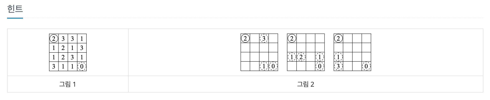
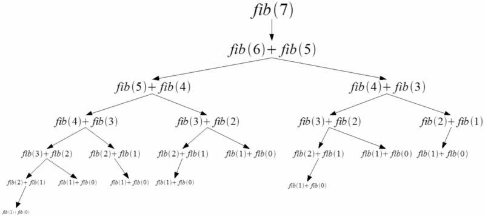
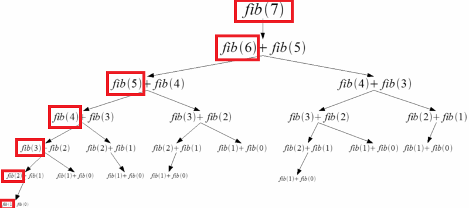

# BOJ_1890. 점프


출처: https://www.acmicpc.net/problem/1890


|   시간 제한   |   메모리 제한 |
|   ---       |     ---    |
|   1초      |    128MB     |

<br>

## 문제

<br>

N×N 게임판에 수가 적혀져 있다. 이 게임의 목표는 가장 왼쪽 위 칸에서 가장 오른쪽 아래 칸으로 규칙에 맞게 점프를 해서 가는 것이다.

각 칸에 적혀있는 수는 현재 칸에서 갈 수 있는 거리를 의미한다. 반드시 오른쪽이나 아래쪽으로만 이동해야 한다. 0은 더 이상 진행을 막는 종착점이며, 항상 현재 칸에 적혀있는 수만큼 오른쪽이나 아래로 가야 한다. 한 번 점프를 할 때, 방향을 바꾸면 안 된다. 즉, 한 칸에서 오른쪽으로 점프를 하거나, 아래로 점프를 하는 두 경우만 존재한다.

가장 왼쪽 위 칸에서 가장 오른쪽 아래 칸으로 규칙에 맞게 이동할 수 있는 경로의 개수를 구하는 프로그램을 작성하시오.

<br>

## 입력

<br>

첫째 줄에 게임 판의 크기 N (4 ≤ N ≤ 100)이 주어진다. 그 다음 N개 줄에는 각 칸에 적혀져 있는 수가 N개씩 주어진다. 칸에 적혀있는 수는 0보다 크거나 같고, 9보다 작거나 같은 정수이며, 가장 오른쪽 아래 칸에는 항상 0이 주어진다.

<br>

## 출력

<br>

가장 왼쪽 위 칸에서 가장 오른쪽 아래 칸으로 문제의 규칙에 맞게 갈 수 있는 경로의 개수를 출력한다. 경로의 개수는 $$2^{63}-1$$보다 작거나 같다.

<br>

## 입출력 예시

<br>


**예제 입력 1**

```
4
2 3 3 1
1 2 1 3
1 2 3 1
3 1 1 0
```

**예제 출력 1**

```
3
```




---


DP를 조금 더 이해해보자.

- 재귀 방식의 피보나치 함수 구현
```java
static int fibo(int N) {
	if(N == 0){
        return 0;
    }
	if(N == 1){
      return 1;  
    } 
 
	return fibo(N - 1) + fibo(N - 2);
}
```

위 방법은 $$O(2^N)$$의 시간복잡도를 지님




> 중복되는 노드(fib(1), fib(2), ...)의 존재가 불필요한 연산을 늘리고 있다.


---


- 메모이제이션 기법을 활용한 피보나치 함수 구현
```java
package boj_1890_점프;

public class Fibonacci {
	 
    static long[] memo;

    public static long fibo(int n) {
        if (n <= 1) {
            return n;
        }
        // 이미 계산한 적이 있다면? 계산없이 memo해놓은 것을 조회해서 반환하자.
        else if (memo[n] != 0) {
            return memo[n];
        }
        else
            return memo[n] = fibo(n - 1) + fibo(n - 2);
 
    }
    
    public static void main(String[] args) {
        memo = new long[101];
        System.out.println(fibo(100));
    }
}
```



$$O(N)