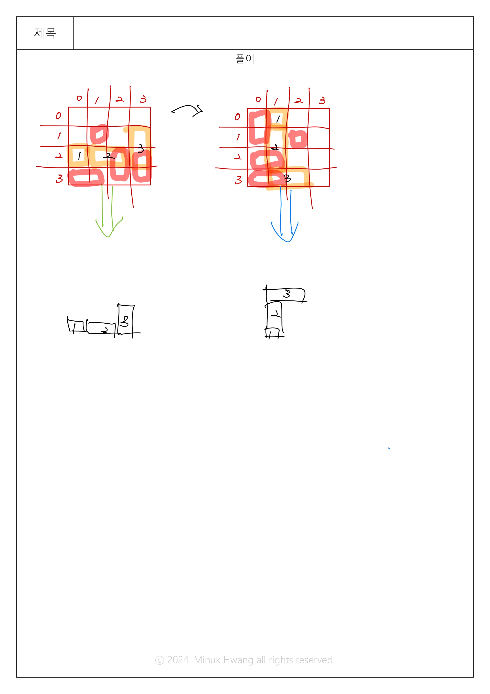

# BOJ_20061. 모노미노도미노


출처: https://www.acmicpc.net/problem/20061


|   시간 제한   |   메모리 제한 |
|   ---       |     ---    |
|   1초      |    512MB     |

<br>

## 문제

<br>

<그림 생략>

모노미노도미노는 아래와 같이 생긴 보드에서 진행되는 게임이다. 보드는 빨간색 보드, 파란색 보드, 초록색 보드가 그림과 같이 붙어있는 형태이다. 게임에서 사용하는 좌표 (x, y)에서 x는 행, y는 열을 의미한다. 빨간색, 파란색, 초록색 보드가 사용하는 좌표는 그 색으로 그림에 적혀있다.

이 게임에서 사용하는 블록은 타일 하나 또는 두 개가 가로 또는 세로로 붙어있는 형태이다. 아래와 같이 세 종류가 있으며, 왼쪽부터 순서대로 크기가 1×1, 1×2, 2×1 이다.


블록을 놓을 위치를 빨간색 보드에서 선택하면, 그 위치부터 초록색 보드로 블록이 이동하고, 파란색 보드로 블록이 이동한다. 블록의 이동은 다른 블록을 만나거나 보드의 경계를 만나기 전까지 계속해서 이동한다.

<과정 생략>


행이나 열이 타일로 가득찬 경우와 연한 칸에 블록이 있는 경우가 동시에 발생할 수 있다. 이 경우에는 행이나 열이 타일로 가득 찬 경우가 없을 때까지 점수를 획득하는 과정이 모두 진행된 후, 연한 칸에 블록이 있는 경우를 처리해야 한다.

블록은 보드에 놓인 이후에 다른 블록과 합쳐지지 않는다. 블록을 놓은 위치가 순서대로 주어졌을 때, 얻은 점수와 초록색 보드와 파란색 보드에 타일이 있는 칸의 개수를 모두 구해보자.


<br>

## 입력

<br>

첫째 줄에 블록을 놓은 횟수 N(1 ≤ N ≤ 10,000)이 주어진다.

둘째 줄부터 N개의 줄에 블록을 놓은 정보가 한 줄에 하나씩 순서대로 주어지며, t x y와 같은 형태이다.

- t = 1: 크기가 1×1인 블록을 (x, y)에 놓은 경우
- t = 2: 크기가 1×2인 블록을 (x, y), (x, y+1)에 놓은 경우
- t = 3: 크기가 2×1인 블록을 (x, y), (x+1, y)에 놓은 경우

블록이 차지하는 칸이 빨간색 칸의 경계를 넘어가는 경우는 입력으로 주어지지 않는다.
<br>

## 출력

<br>

첫째 줄에 블록을 모두 놓았을 때 얻은 점수를 출력한다.

둘째 줄에는 파란색 보드와 초록색 보드에서 타일이 들어있는 칸의 개수를 출력한다.

<br>

## 입출력 예시

<br>


**예제 입력 1**

```
1
1 1 1
```

**예제 출력 1**

```
0
2
```




