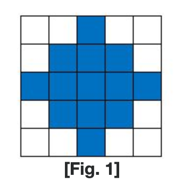
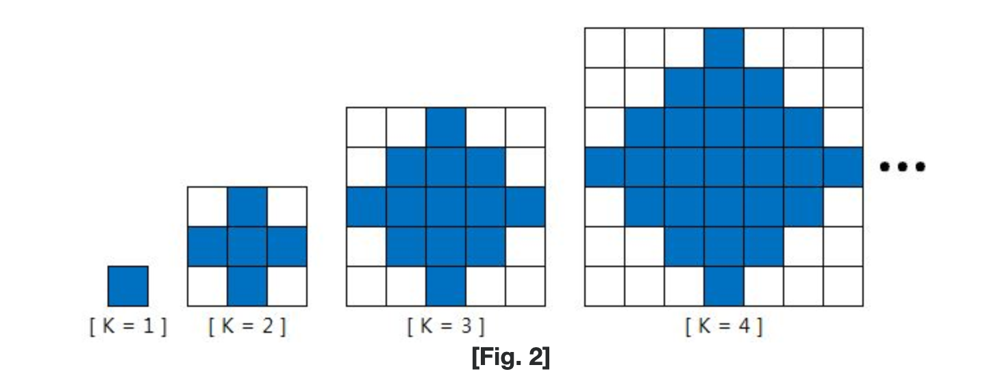
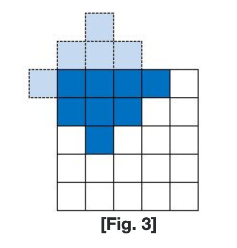
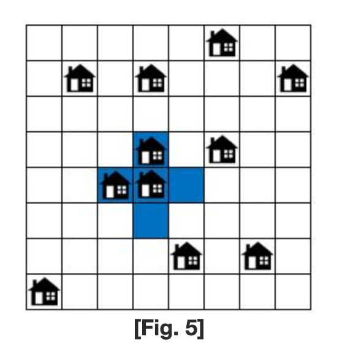
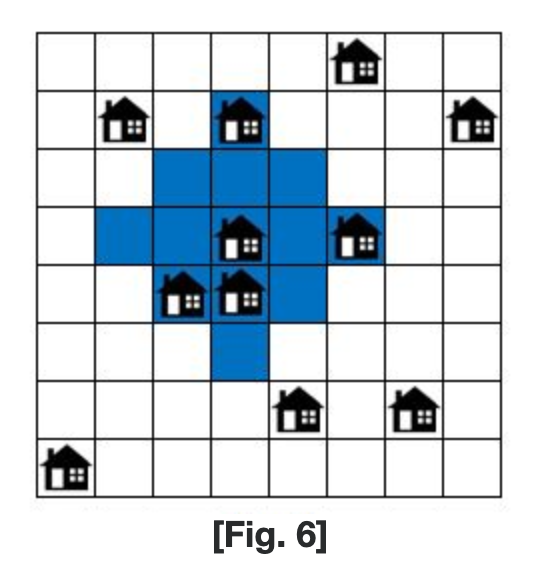

# SWEA_2117. 홈 방범 서비스


출처: https://swexpertacademy.com/main/code/problem/problemDetail.do?contestProbId=AV5V61LqAf8DFAWu


|   시간 제한   |   메모리 제한 |
|   ---       |     ---    |
|   3초      |    256MB     |

<br>

## 문제

<br>


N*N 크기의 도시에 홈방범 서비스를 제공하려고 한다.

홈방범 서비스는 운영 상의 이유로 [Fig. 1]의 파란색 부분과 같이 마름모 모양의 영역에서만 제공된다.
 
 


또한, 홈방범 서비스를 제공하기 위해서는 운영 비용이 필요하다.

[Fig. 2]와 같이 서비스 영역의 크기 K 가 커질수록 운영 비용이 커진다.

운영 비용은 서비스 영역의 면적과 동일하며, 아래와 같이 구할 수 있다.

운영 비용 = K * K + (K - 1) * (K - 1)

운영 영역의 크기 K 는 1 이상의 정수이다.

 - K = 1 일 때, 운영 비용은 1 이다.

 - K = 2 일 때, 운영 비용은 5 이다.

 - K = 3 일 때, 운영 비용은 13 이다.

 - K = 4 일 때, 운영 비용은 25 이다.


 

 


[Fig. 3]과 같이 도시를 벗어난 영역에 서비스를 제공해도 운영 비용은 변경되지 않는다.

[Fig. 3]의 경우 K = 3 이므로, 운영 비용은 13 이다.
 





홈방범 서비스를 제공받는 집들은 각각 M의 비용을 지불할 수 있어, 보안회사에서는 손해를 보지 않는 한 최대한 많은 집에 홈방범 서비스를 제공하려고 한다.

도시의 크기 N과 하나의 집이 지불할 수 있는 비용 M, 도시의 정보가 주어진다.

이때, 손해를 보지 않으면서 홈방범 서비스를 가장 많은 집들에 제공하는 서비스 영역을 찾고,

그 때의 홈방범 서비스를 제공 받는 집들의 수를 출력하는 프로그램을 작성하라.


[예시]

예를 들어, [Fig. 4]과 같이 N이 8인 도시의 정보가 주어지고, 하나의 집이 지불할 수 있는 비용 M이 3이라고 생각해 보자.

 


[Fig. 5]와 같이 서비스 영역 K = 2로 하여 홈방범 서비스를 제공할 때는 최대 3개의 집까지 서비스 제공이 가능하다.

이 경우 보안회사의 이익은 4가 되어 손해를 보지 않고 서비스 제공이 가능하다.

보안회사의 이익(4) = 서비스 제공받는 집들을 통해 얻는 수익(3*3) - 운영 비용(5)

 




[Fig. 6]은 서비스 영역 K = 3으로 하여 홈방범 서비스를 제공할 때에 최대 5개의 집까지 서비스 제공이 가능한 경우 중 하나이다.

보안회사의 이익(2) = 서비스 제공받는 집들을 통해 얻는 수익(3*5) - 운영 비용(13)
 




위의 예에서, 보안회사가 손해를 보지 않고 서비스 가능한 최대 집의 수는 5이며, 5가 정답이 된다.


<br>

## 제약사항

<br>


1. 시간제한 : 최대 50개 테스트 케이스를 모두 통과하는데, C/C++/Java 모두 3초

2. 도시의 크기 N은 5 이상 20 이하의 정수이다. (5 ≤ N ≤ 20)

3. 하나의 집이 지불할 수 있는 비용 M은 1 이상 10 이하의 정수이다. (1 ≤ M ≤ 10)

4. 홈방범 서비스의 운영 비용은 서비스 영역의 면적과 동일하다.

5. 도시의 정보에서 집이 있는 위치는 1이고, 나머지는 0이다.

6. 도시에는 최소 1개 이상의 집이 존재한다.


<br>

## 입력

<br>

입력은 여러 개의 테스트 케이스로 이루어져 있다. 각 테스트 케이스의 첫째 줄에는 지도의 너비 w와 높이 h가 주어진다. w와 h는 50보다 작거나 같은 양의 정수이다.

둘째 줄부터 h개 줄에는 지도가 주어진다. 1은 땅, 0은 바다이다.

입력의 마지막 줄에는 0이 두 개 주어진다.


<br>

## 출력

<br>

각 테스트 케이스에 대해서, 섬의 개수를 출력한다.

<br>

## 입출력 예시

<br>


**예제 입력**

```
10      	        //총 테스트 케이스 개수 T=10
8 3                 //첫 번째 테스트 케이스, N=8, M=3
0 0 0 0 0 1 0 0
0 1 0 1 0 0 0 1
0 0 0 0 0 0 0 0
0 0 0 1 0 1 0 0
0 0 1 1 0 0 0 0
0 0 0 0 0 0 0 0
0 0 0 0 1 0 1 0
1 0 0 0 0 0 0 0
…                   //나머지는 sample_input.txt 참조
```

**예제 출력**

```
#1 5
#2 4
#3 24
#4 48
#5 3
#6 65
#7 22
#8 22
#9 78
#10 400
```

---


<br>

## 풀이

<br>


제한된 시간 안에 빠르게 로직을 구현하는 것에 집중해서 문제를 접근해보자.

1. 20 x 20 크기라면 완전 탐색이 가능할 것

2. 모든 좌표마다 서비스 영역을 넓히며 탐색할 것

    2-1. 서비스 영역(k)을 어디까지 늘릴 것인가?

    2-2. 비용에 따라 언제 멈추고, 갱신할 것인가?

3. depth만큼의 탐색(2차원 배열 마름모), 어떻게 구현할 것인가?


