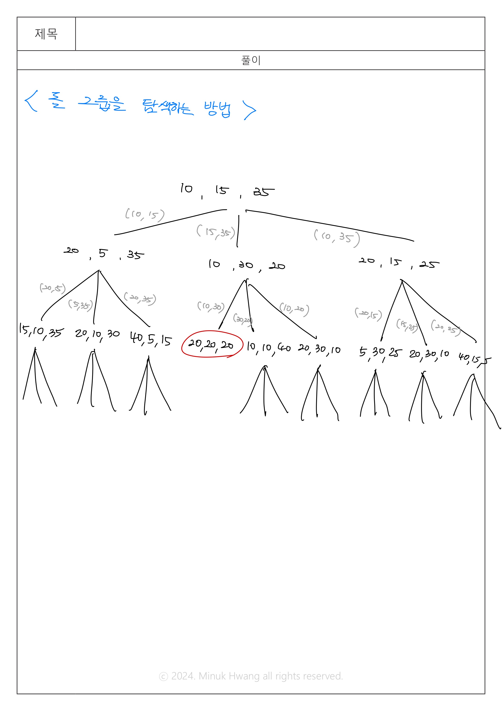

# BOJ_12886 돌 그룹


출처: https://www.acmicpc.net/problem/12886


|   시간 제한   |   메모리 제한 |
|   ---       |     ---    |
|   2초      |    512MB     |

<br>

## 문제

<br>

오늘 강호는 돌을 이용해 재미있는 게임을 하려고 한다. 먼저, 돌은 세 개의 그룹으로 나누어져 있으며 각각의 그룹에는 돌이 A, B, C개가 있다. 강호는 모든 그룹에 있는 돌의 개수를 같게 만들려고 한다.

강호는 돌을 단계별로 움직이며, 각 단계는 다음과 같이 이루어져 있다.

크기가 같지 않은 두 그룹을 고른다. 그 다음, 돌의 개수가 작은 쪽을 X, 큰 쪽을 Y라고 정한다. 그 다음, X에 있는 돌의 개수를 X+X개로, Y에 있는 돌의 개수를 Y-X개로 만든다.

A, B, C가 주어졌을 때, 강호가 돌을 같은 개수로 만들 수 있으면 1을, 아니면 0을 출력하는 프로그램을 작성하시오.


<br>

## 입력

<br>

첫째 줄에 A, B, C가 주어진다. (1 ≤ A, B, C ≤ 500)

<br>

## 출력

<br>

돌을 같은 개수로 만들 수 있으면 1을, 아니면 0을 출력한다.

<br>

## 입출력 예시

<br>


**예제 입력 1**

```
10 15 35
```

**예제 출력 1**

```
1
```


**예제 입력 2**

```
1 1 2
```

**예제 출력 2**

```
0
```

<br>

## 풀이

<br>

- 돌은 3개로 고정
- 같은 돌로 쪼갤 수 있는지 먼저 확인 <=> 돌의 개수의 합이 3의 배수인지를 확인
- 탐색 시 방문체크로 가지치기하는 것이 중요하다
  - 이미 탐색한 돌 그룹의 조합이라면 탐색하지 않는다.

