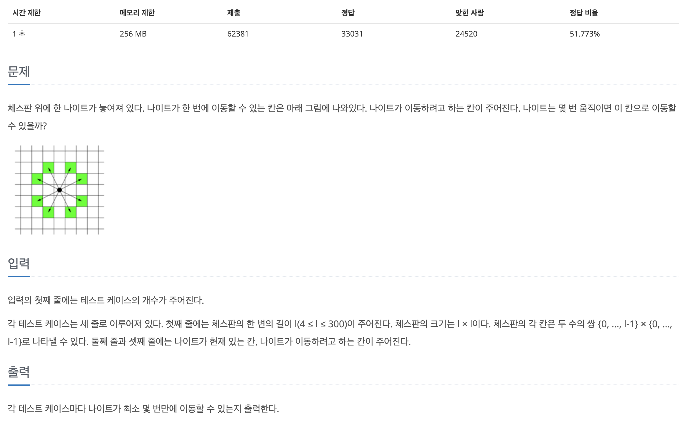

## 📖 [나이트의 이동](https://www.acmicpc.net/problem/7562)
#### 📍 문제

---
#### 📍 풀이
- bfs를 이용하여 방문 가능한 방향을 모두 탐색하여 최적의 경로를 찾도록 구현했다.
---
#### 📍 느낀점
- 알고리즘을 오랜만에 풀기도 하고, 원래 bfs 관련 문제를 많이 풀지 않아서 다시 새로 공부하는 기분이었다. 어려운 문제는 아니기 때문에 비슷한 문제를 만나면 빠르게 풀이 방법을 떠올릴 수 있도록 연습해야겠다.