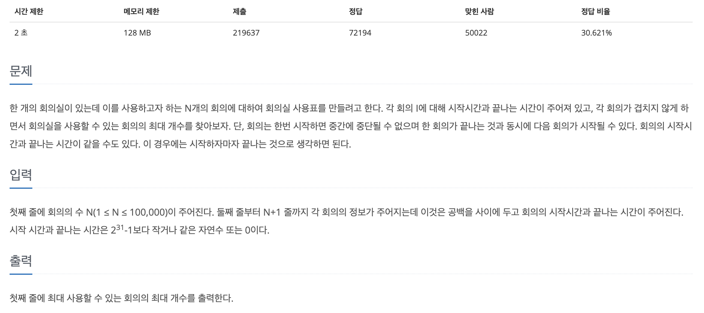
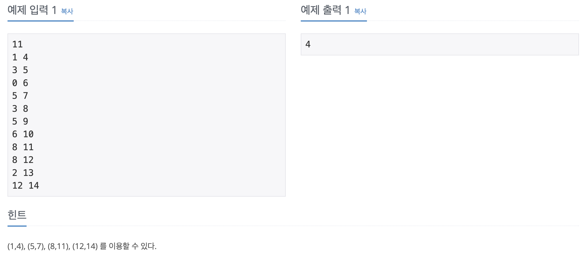

## 📖 [회의실 배정](https://www.acmicpc.net/problem/1931)
#### 📍 문제

---
#### 📍 풀이
- 그리디 알고리즘을 이용했다. 회의들을 끝나는 시간이 빠른 순으로 정렬하여, 한 회의를 선택했을 때, 그 회의의 끝나는 시간 이후에 시작하는 회의들 중에서 가장 빠른 시작 시간을 가진 회의를 선택하도록 했다.
---
#### 📍 느낀점
- 그리디 알고리즘으로 문제를 푼 건 처음인 것 같은데, 개념은 알겠지만 문제에 적용할 때에는 아직 직관적으로 딱 이해하기 어려운 것 같다. 처음에 제한시간 때문에 해결이 안되어서 다른 풀이를 조금 참조했는데 다음에 비슷한 유형을 만나면 스스로 풀어보고 싶다.