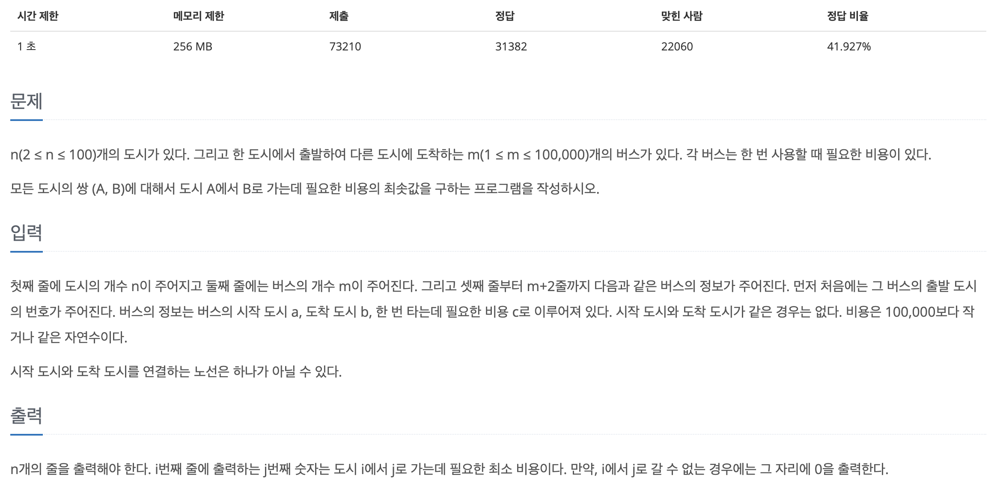
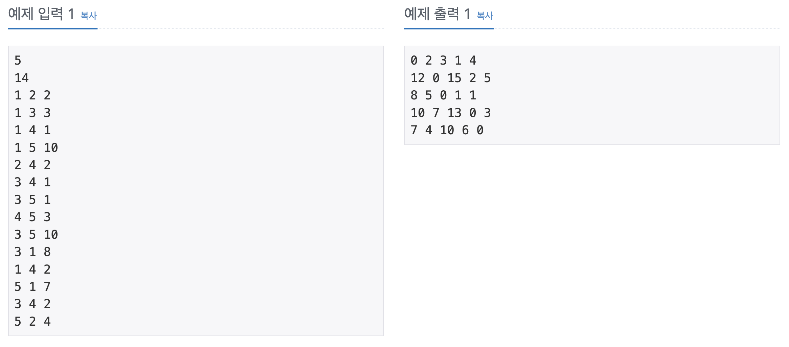

## 📖 [플로이드](https://www.acmicpc.net/problem/11404)
#### 📍 문제

---
#### 📍 풀이
- 기본적인 플로이드-워셜 알고리즘을 이용한 풀이
- 플로이드-워셜 알고리즘이란?
  - 💡 **모든 지점에서 다른 모든 지점까지의 최단 경로를 계산하는 알고리즘**
  - 시간 복잡도 : $O(N^3)$
      → 노드의 개수가 N개일 때, N번의 단계를 수행하며 단계마다 $O(N^2)$의 연산을 통해 현재 노드를 거쳐가는 모든 경로를 고려 
  - DP 이용
      → 점화식 : $D_{ab} = min(D_{ab}, D_{ak} + D_{kd})$ 
  - 구현
      1.모든 간선의 값을 무한대로 초기화, 자기 자신으로 향하는 간선은 0으로 초기화
      2. 초기 그래프의 노드와 간선 정보에 따라 최단 거리 테이블 갱신
      3. A → B 로 갈 때, 1~N 번 노드를 거쳐 가는 경우와 A → B 로 바로 가는 경우를 비교하여 테이블 갱신
---
#### 📍 느낀점
- 코드 구현도 짧고, 다익스트라와 DP를 이해하고 있으면 쉬운 알고리즘이라고 느꼈다.