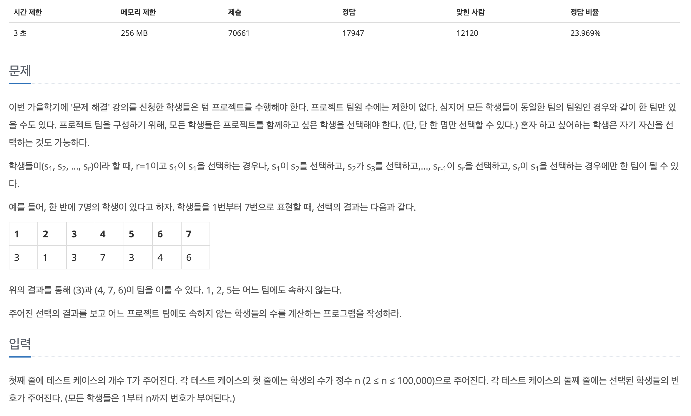
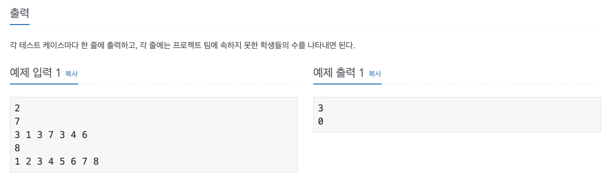

## 📖 [텀 프로젝트](https://www.acmicpc.net/problem/9466)
#### 📍 문제

---
#### 📍 풀이
- 한 노드에서 visited가 true일 때 까지 다음 노드를 방문한다. 다음 노드를 방문하며 이전 노드인 before를 저장한다.
- 다음 방문할 노드의 visited가 true이고, 어느 팀에도 속하지 않았다면 before 노드들은 전부 불가능하다고 판단한다.
- next 노드는 전부 가능하다고 판단한다. 
---
#### 📍 느낀점
- 