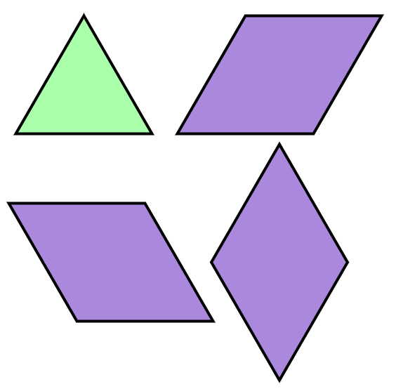
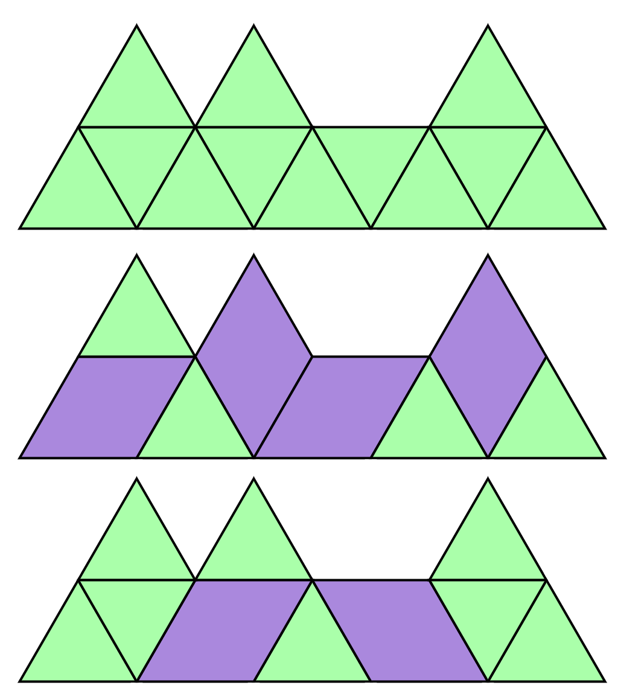

# Kakao\_.산 모양 타일링

출처: https://school.programmers.co.kr/learn/courses/30/lessons/258705

---

시간 제한 메모리 제한 제출 정답 맞힌 사람 정답 비율  
2 초 128 MB 14702 5703 4216 38.306%

## 문제

한 변의 길이가 1인 정삼각형 2n+1개를 이어붙여 윗변의 길이가 n, 아랫변의 길이가 n+1인 사다리꼴을 만들 수 있습니다. 이때 사다리꼴의 윗변과 변을 공유하는 n개의 정삼각형 중 일부의 위쪽에 같은 크기의 정삼각형을 붙여 새로운 모양을 만들었습니다. 예를 들어 n이 4이고, 1번째, 2번째, 4번째 정삼각형 위에 정삼각형을 붙인 모양은 다음과 같습니다.


이렇게 만든 모양을 정삼각형 타일 또는 정삼각형 2개를 이어 붙인 마름모 타일로 빈 곳이 없도록 채우려고 합니다. 정삼각형 타일과 마름모 타일은 돌려서 사용할 수 있습니다.



타일을 놓을 때 다른 타일과 겹치거나 모양을 벗어나게 놓을 수는 없습니다. 위의 예시 모양을 채우는 방법 중 일부는 다음과 같습니다.



사다리꼴의 윗변의 길이를 나타내는 정수 n과 사다리꼴 윗변에 붙인 정삼각형을 나타내는 1차원 정수 배열 tops가 매개변수로 주어집니다. 이때 문제 설명에 따라 만든 모양을 정삼각형 또는 마름모 타일로 빈 곳이 없도록 채우는 경우의 수를 10007로 나눈 나머지를 return 하도록 solution 함수를 완성해 주세요.

## 제한사항

- 1 ≤ n ≤ 100,000
- tops의 길이 = n
  - tops[i]는 사다리꼴의 윗변과 변을 공유하는 i+1번째 정삼각형의 위쪽에 정삼각형을 붙이는 경우 1, 붙이지 않는 경우 0입니다.

```
n	tops	result
4	[1, 1, 0, 1]	149
2	[0, 1]	11
10	[0, 0, 0, 0, 0, 0, 0, 0, 0, 0]	7704
```

예제입력1

```
문제의 예시와 같습니다. 문제에서 설명한 방법을 포함해 총 149가지 방법이 존재합니다.

따라서 149를 return 해야 합니다.
```

이하 생략
