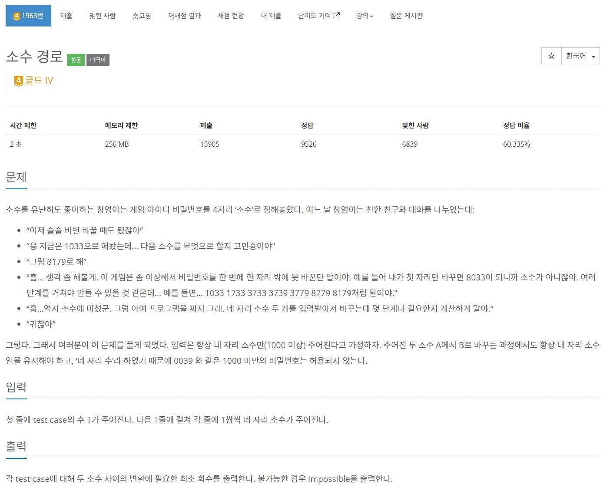
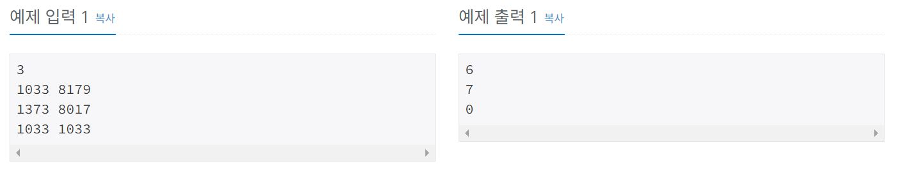

https://www.acmicpc.net/problem/1963

# 🔍 소수 경로

- 설계 시간 : ? min
- 구현 시간 : ? min
- 난이도 : 골드 4
- 알고리즘 : 에라토스테네스의 체 + BFS
- 코드 길이 : 2949B
- 실행 시간 : 64ms(시간 제한 2초)
- 메모리 : 11744KB

---

# 💡 아이디어

- 소수면 일단 무지성 에라토스테네스의 체
- 경로를 찾는게 아이디어가 안떠오르면 좀 어려울수도 있을 것 같은데 BFS인걸 알고 풀어서 간단하게 해결했다.
- 에라토스테네스의 체 구현 + 최단거리 BFS 구현 + 자릿수 바꾸기 테크닉 종합 문제

---

# ✔ 문제 풀이

- 아이디어 그대로 구현하면 되고 네 자리 소수만 유효해서 1000 이하의 소수는 예외처리를 해줘야 하는데 그냥 1000이하의 수는 전부 소수가 아니라고 못박으면 간단하게 해결 가능

# 🧠 어려웠던 점

- 에라토스테네스의 체를 잘못구현하고 있어서 이번에 새롭게 다시 공부했는데 init 메서드의 이중 for문 코드대로 구현해야 O(N log log N)의 시간복잡도로 소수 구하기 가능
- 자릿수 바꾸기 잡기술도 오랜만에 해서 약간 절었는데 형변환하고 메서드로 구하는거보다 저렇게 사칙연산으로 처리하는게 더 빠를거 같아서 저렇게 품

---

# 🧐 좋은 풀이

- 이게 제일 빠름
