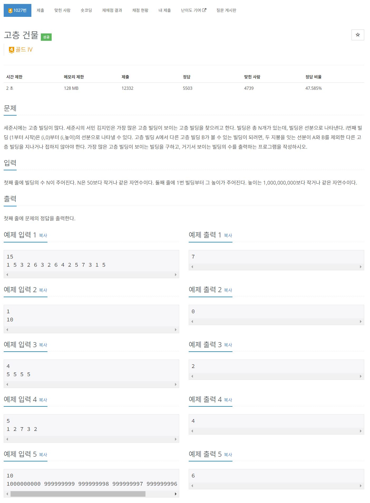
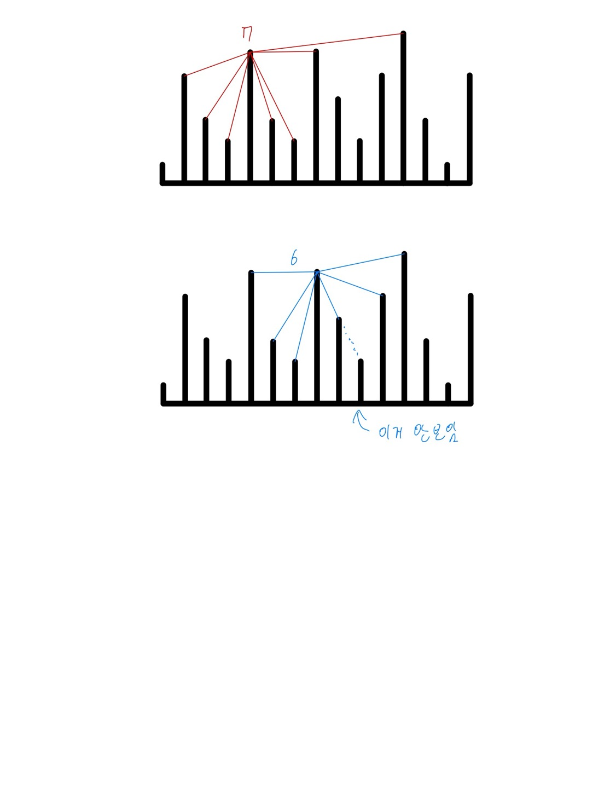
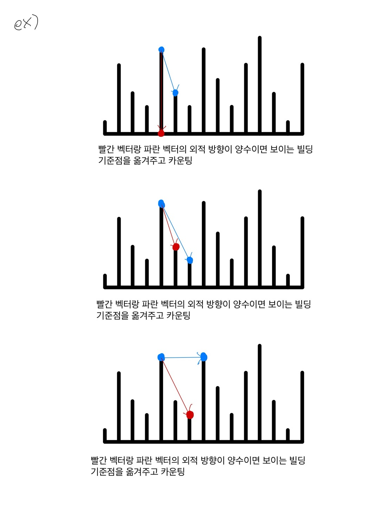
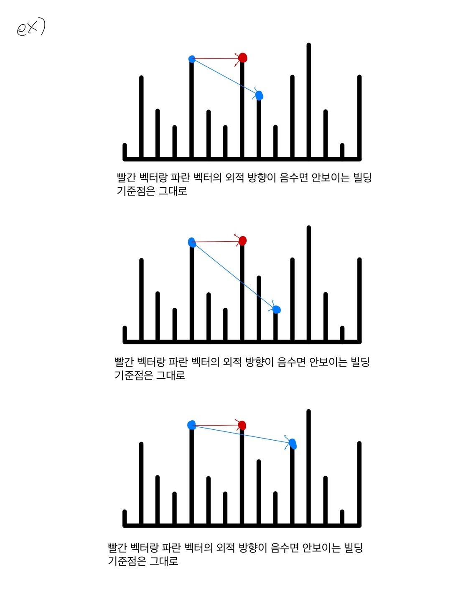
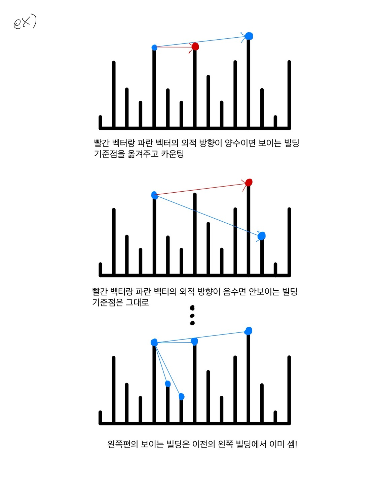
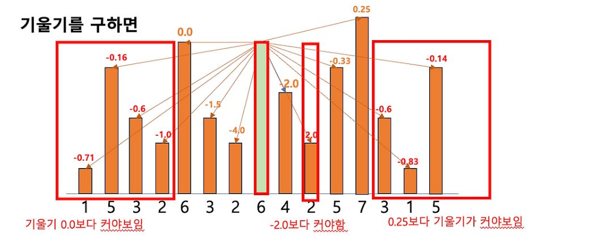

https://www.acmicpc.net/problem/1027

# 🔍 고층 건물

| 항목      | 내용                              |
| --------- | --------------------------------- |
| 설계 시간 | ? min                             |
| 구현 시간 | ? min                             |
| 난이도    | 골드 4                            |
| 알고리즘  | 수학, 브루트포스 알고리즘, 기하학 |
| 코드 길이 | 1499B                             |
| 실행 시간 | 64ms (시간 제한 2초)              |
| 메모리    | 11612KB (메모리 제한 128MB)       |

---

# 💡 아이디어

- CCW 알고리즘을 활용해서 빌딩이 보이는지 판단

---

# ✔ 문제 풀이

- 기준점을 설정하면 O(N³) -> O(N²)
- 좌우를 각각 계산하지 않으면 계산량 절반

---

# 🧠 어려웠던 점

- 코테 모음 어쩌구에 있던 문제라 기하 문제는 아닐줄 알았음
- 대부분 그냥 직선의 기울기 방정식을 활용한 2중 반복문으로 해결함(메커니즘은 거의 비슷)
- 기울기 double형이라 애매해보였는데, 항상 가능한 방식인지는 모르겠음(항상 되는거 같기도 하고?)

---

# 🧐 좋은 풀이
