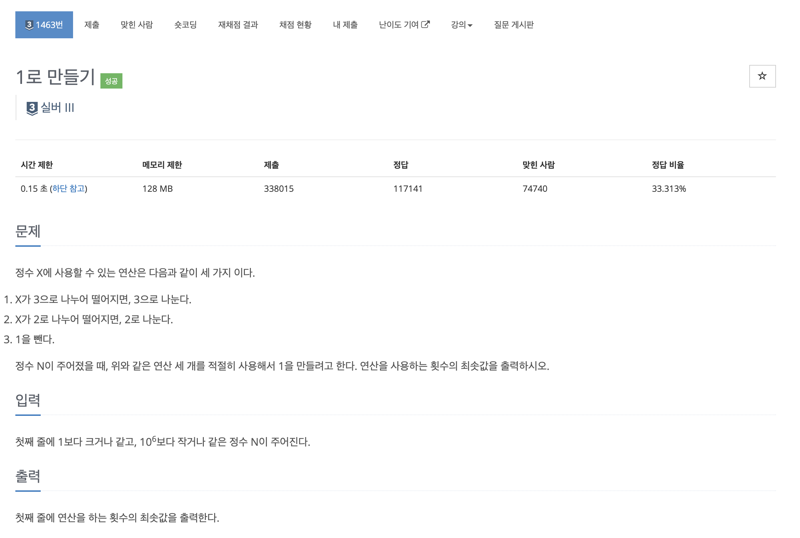
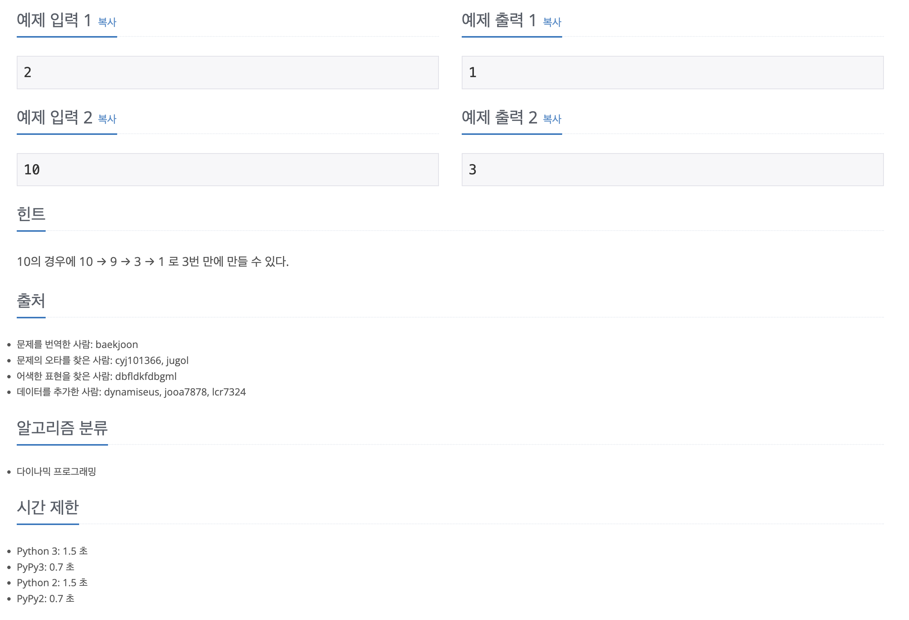

https://www.acmicpc.net/problem/1463

# 🔍 1로 만들기

| 항목      | 내용                                |
| --------- |-----------------------------------|
| 설계 시간 | 15 min                            |
| 구현 시간 | 15 min                            |
| 난이도    | 실버 3                              |
| 알고리즘  | 다이나믹 프로그래밍                        |
| 코드 길이 | 1128B / 652B                      |
| 실행 시간 | 508ms / 96ms (시간 제한 0.15초)        |
| 메모리    | 112216KB / 15732KB (메모리 제한 128MB) |

---

# 💡 아이디어

- 다이나믹 프로그래밍으로 해결활 수 있다.

---

# ✔ 문제 풀이

- 주어진 정수 크기만큼 dp 배열을 생성한다.
- dp 배열을 순회하며 값을 채워주는데 6의 배수 인덱스면 3과 2 둘 다 나누어 떨어지니 3가지 경우에 대해 최솟값 + 1, 2 또는 3으로 나누어 떨어지면 1을 빼는 경우까지 2가지 경우에 대해 최솟값 + 1로 값을 찾아준다.

---

# 🧠 어려웠던 점

- Top-Down 방식의 문제 같아 보였는데 Bottom-Up으로 풀게된 과정이 약간 어려웠다.

---

# 🧐 좋은 풀이
