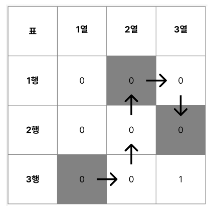
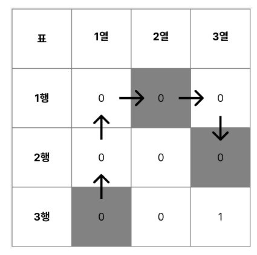
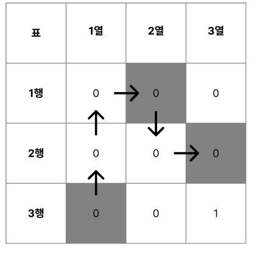

# 1_PLAN-160_soft-6246_순서대로방문하기

## 문제

시간 제한: 1초
메모리 제한: 1024MB

Sam은 팀장님으로부터 차량이 이동 가능한 시나리오의 수를 찾으라는 업무 지시를 받았습니다. 이동은 숫자 0과 1로만 이루어져 있는 n x n 크기의 격자 위에서 일어납니다. 숫자 0은 빈 칸을 의미하며, 숫자 1은 해당 칸이 벽으로 막혀 있음을 의미합니다. 아래는 n이 3인 경우의 예시입니다.

0 0 0
0 0 0
0 0 1

차량은 n x n 격자 내에서 m개의 지점을 순서대로 방문하려고 합니다. 이 때 이동은 항상 상하좌우 중 인접한 칸으로만 이동하되 벽은 지나갈 수 없으며, 한 번 지났던 지점은 다시는 방문해서는 안 됩니다. 이러한 조건 하에서 차량이 이동 가능한 서로 다른 가지 수를 구하는 프로그램을 작성해보세요.

방문해야 하는 지점의 첫 지점이 출발점이며, 마지막 지점이 도착점임에 유의합니다.

위의 예에서 m = 3, 방문해야 하는 지점이 순서대로 (3행, 1열), (1행, 2열), (2행, 3열)이라면, 다음과 같이 5가지의 시나리오가 가능합니다.

1. **(3행, 1열)** → (3행, 2열) → (2행, 2열) → **(1행, 2열)** → (1행, 3열) → **(2행, 3열)**



2. **(3행, 1열)** → (3행, 2열) → (2행, 2열) → (2행, 1열) → (1행, 1열) → **(1행, 2열)** → (1행, 3열) → **(2행, 3열)**


3. **(3행, 1열)** → (2행, 1열) → (2행, 2열) → **(1행, 2열)** → (1행, 3열) → **(2행, 3열)**


4. **(3행, 1열)** → (2행, 1열) → (1행, 1열) → **(1행, 2열)** → (1행, 3열) → **(2행, 3열)**



5. **(3행, 1열)** → (2행, 1열) → (1행, 1열) → **(1행, 2열)** → (2행, 2열) → **(2행, 3열)**



## 제약 조건

[조건 1] 2 ≤ n ≤ 4

[조건 2] 2 ≤ m ≤ n2

## 입력

첫 번째 줄에는 격자의 크기를 나타내는 n과 순서대로 방문해야 하는 칸의 수 m이 공백을 사이에 두고 주어집니다.

두 번째 줄부터는 n개의 줄에 걸쳐 각 행에 해당하는 n개의 수가 공백을 사이에 두고 주어집니다. 주어지는 수는 0 또는 1이며, 0은 빈 칸을 1은 벽을 의미합니다.

n + 2 번째 줄부터는 m개의 줄에 방문해야 할 m개의 칸의 위치 (x, y) 쌍이 공백을 사이에 두고 한 줄에 하나씩 순서대로 주어집니다. 주어지는 칸에 벽이 있는 경우는 없으며, 동일한 칸이 여러 번 주어지는 경우는 없다고 가정해도 좋습니다.

## 출력

차량이 m개의 지점을 순서대로 방문할 수 있는 서로 다른 방법의 수를 출력합니다. 만약 가능한 방법이 없다면 0을 출력합니다.

## 예제 입력1

```
3 3
0 0 0
0 0 0
0 0 1
3 1
1 2
2 3
```

## 예제 출력1

```
5
```

## 예제 입력2

```
3 3
0 0 1
0 0 0
0 0 1
3 1
1 2
2 3
```

## 예제 출력2

```
1
```
