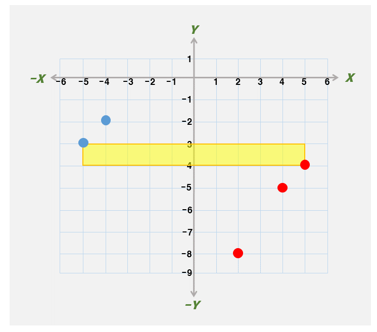
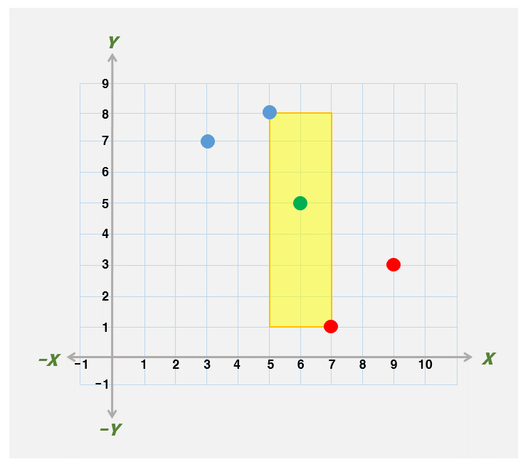

# 3*PLAN-164_soft-6277*사물인식최소면적산출프로그램

## 문제

시간 제한: 5초
메모리 제한: 256MB

현대자동차그룹에 입사한 당신은 레이더 기술을 활용해 차량 주변의 장애물과 사물을 인식하는 프로그램을 만드는 업무를 담당하고 있다.


당신은 다양한 입력 값들로 인식된 사물에 대해 최소 면적을 계산해보는 테스트를 하는 중이다. 이번 테스트의 조건은 다음과 같다.

레이더를 통해 인식된 정보의 입력값은 평면에 N개의 점으로 주어진다. 각각의 점들은 총 K개의 색깔 중 하나를 가지고 있다. 각 점의 색깔은 {1, 2, …, K} 중의 한 정수로 표현된다.

당신은 입력값으로 주어진 K개의 색깔 {1, 2, …, K}에 대해 해당 색깔을 가지는 점들을 적어도 하나씩 포함하는 사물 중 넓이가 가장 작은 것을 찾아서 그 넓이를 출력하는 프로그램을 작성하려고 한다. 이때, 각 점을 포함한 사물은 반드시 직사각형으로 인식된다.

여기서 사물로 인식되는 직사각형은 네 변이 모두 수평 혹은 수직인 것에 한정하며, 직사각형의 내부가 아닌 경계에 놓은 점들도 그 직사각형에 포함된다고 생각한다. 직사각형의 가로 또는 세로의 길이가 0이 되어 선분 혹은 점으로 나타나는 경우도 직사각형의 한 경우로 생각하며 이런 경우 직사각형의(사물) 넓이는 0이다. (하나의 좌표에 여러 개의 점이 있을 수 있다.)

주어지는 입력값에 대해 K개의 색을 가진 점들을 적어도 하나씩 포함하는 사물(직사각형) 중 넓이가 가장 작은 것의 넓이를 출력하는 프로그램을 만들어보자.

## 제약조건

1 ≤ N ≤ 100

1 ≤ K ≤ 20

-1,000 ≤ x, y ≤ 1,000

1 ≤ k ≤ K

## 입력

입력으로는 점의 개수인 자연수 N과 각 점들이 가질 수 있는 색깔의 총 개수인 자연수 K가 첫 줄에 주어진다.

이후, N줄에는 입력으로 주어지는 점의 좌표 (x, y)와 그 점의 색깔 k가 세 개의 정수 x, y, k로 각 줄에 주어진다.

## 출력

주어진 입력에 대해 K개의 색깔 {1, 2, …, K} 각각에 대해 해당 색깔을 가지는 점들을 적어도 하나씩 포함하는 사물(직사각형) 중 넓이가 가장 작은 것을 찾아서 그 넓이를 정수 형태로 출력한다.

## 예제 입력1

```
5 2
-4 -2 1
-5 -3 1
5 -4 2
4 -5 2
3 -8 2
```

## 예제 출력1

```
10
```

## 예제 입력2

```
5 3
3 7 1
5 8 1
6 5 2
7 1 3
9 3 3
```

## 예제 출력2

```
14
```

## 예제 입력3

```
-4 0 1
-5 -1 1
0 43 2
3 23 3
8 -19 2
10 0 3
20 0 2
```

## 예제 출력3

```
0
```

## 예제 입력4

```
3 3
1 1 1
1 1 2
1 1 3
```

## 예제 출력4

```
0
```

예를 들어, 점의 개수(N)는 5이며, 점의 색깔(K)은 2가지로 좌표평면상 아래와 같이 점이 입력되었다고 할 때, 최소한 다른 색깔의 점을 하나 이상 포함하는 직사각형(사물) 중 가장 작은 면적은 10임을 알 수 있다.



또한 점의 개수(N)는 5이며, 점의 색깔(K)은 3가지로 좌표평면상 아래와 같이 점이 입력되었다고 할 때, 최소한 다른 색깔의 점을 하나 이상 포함하는 직사각형(사물) 중 가장 작은 면적은 14임을 알 수 있다.


