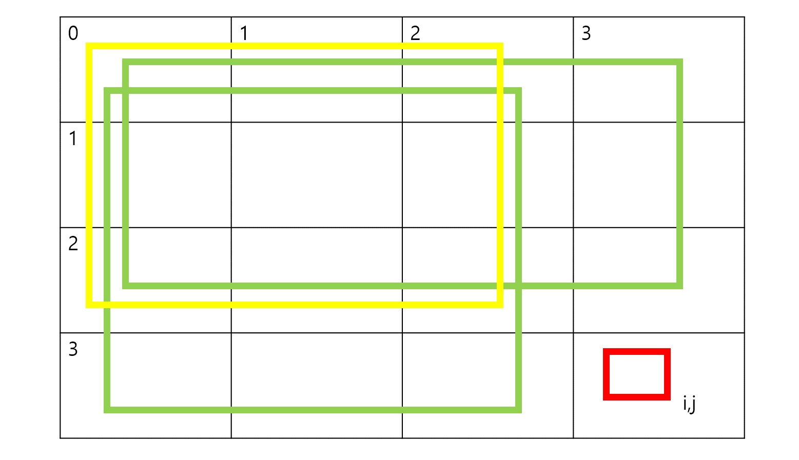
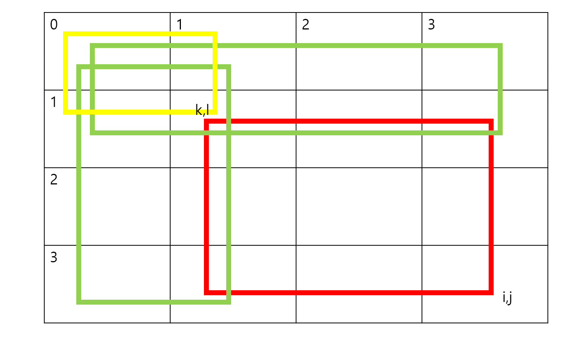

# 누적합

## 1차원 누적합

생략

## 2차원 누적합

0으로 padding을 할 것인가, 말 것인가의 차이 존재 (할 경우 i+1, j+1 (N,M도 하나씩 늘어남.))

// padding 할 것이다.
|0|0|0|0|0|
|---|---|---|---|---|
|0| 1  | 3  | 6  | 10  |
|0|  7 |16|   |   |
|0|  18 |   |   |   |


// padding 안 할 것이다.
|1|3|6|10|15|
|---|---|---|---|---|
|7|16|   |   |   |
|18|   |   |   |   |
|   |   |   |   |   |

padding을 할 경우, 0행, 0열에 있는 원소들도 같은 수식으로 접근할 수 있어 보기 좋다는 장점이 있음. 대신에 index에 접근할 때 행, 열 모두 +1씩 해줘야함.

### 생성


```
pS[i][j] = pS[i-1][j] + pS[i][j-1] - pS[i-1][j-1] + arr[i][j]
```

### 접근

```
pS((k,l)~(i,j)) = pS[i][j] - pS[k][j] - pS[i][l] + pS[k][l]
```

